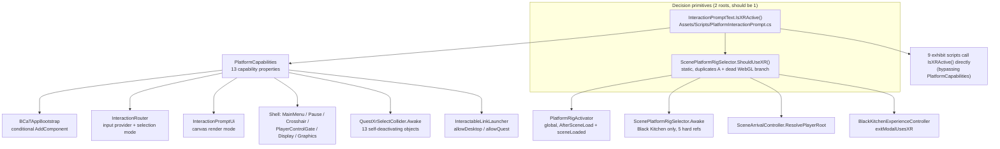
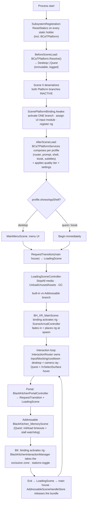

# BCaT Platform Architecture — Design Review

**Status:** design review only. No code, scenes, prefabs, or settings were changed
to produce this document.
**Date:** 2026-08-07
**Scope:** Windows 11 x64 desktop · Apple Silicon macOS desktop · Meta Quest (Android + OpenXR)
**Method:** direct audit of `Assets/BCaT`, `Assets/BCaT_assets`, `Assets/Scripts`,
`Assets/Editor/BCaTProduction`, all four production scenes (raw YAML census),
`ProjectSettings/`, `Assets/XR/`, and `Assets/AddressableAssetsData/`.

Companion documents: `01_ARCHITECTURE.md` (as-built description),
`07_INTERACTION_MIGRATION.md`, `08_QUEST_CONFIGURATION.md`,
`14_ADDRESSABLES_REPORT.md`. This document supersedes none of them; it proposes
where the platform layer should go next.

---

## Table of contents

1. [Executive summary](#1-executive-summary)
2. [Current architecture audit](#2-current-architecture-audit)
3. [Defects and fragilities found](#3-defects-and-fragilities-found)
4. [Proposed future architecture](#4-proposed-future-architecture)
5. [Hierarchy design](#5-hierarchy-design)
6. [Global Platform Manager](#6-global-platform-manager)
7. [Platform groups](#7-platform-groups)
8. [Interaction architecture — adapters](#8-interaction-architecture--adapters)
9. [Scene organization](#9-scene-organization)
10. [Editor workflow](#10-editor-workflow)
11. [Validation system](#11-validation-system)
12. [Build pipeline](#12-build-pipeline)
13. [Runtime workflow (end to end)](#13-runtime-workflow-end-to-end)
14. [Migration plan](#14-migration-plan)
15. [Risks](#15-risks)
16. [Long-term maintenance recommendations](#16-long-term-maintenance-recommendations)
17. [Appendix A — platform decision-point inventory](#appendix-a--platform-decision-point-inventory)
18. [Appendix B — scene component census](#appendix-b--scene-component-census)

---

## 1. Executive summary

### What is actually wrong

The project does **not** have too much platform-specific code. It has too many
*platform authorities*, and they disagree about **when** the platform is decided.

There are currently **four independent mechanisms** that select platform content,
and they run at three different times in the frame:

| Mechanism | Where | When it runs |
|---|---|---|
| Hierarchy grouping (`BuildProfiles/XR`, `BuildProfiles/Web`) | main scene only | authoring time, read at `AfterSceneLoad` |
| `ScenePlatformRigSelector` component (5 hard-wired refs) | Black Kitchen only | `Awake`, unordered vs. the rigs it governs |
| `PlatformRigActivator` code sweep (`ScenePlayerRig` markers) | global | `AfterSceneLoad` + every `sceneLoaded` |
| Self-deactivating objects (`QuestXrSelectCollider`) | 13 authored objects | own `Awake` |

Because the *decision* (`ShouldUseXR()` / `IsXRActive()`) is cheap and
scene-independent, but the *application* of that decision is scattered and
late, the project is forced to compensate: `DisableDesktopMovement()` reaches
into the wrong rig by type-name string, `SceneArrivalController` resets private
velocity fields by reflection, `LegacyInteractionPromptSuppressor` runs two
timed passes to hide prompts that should never have been instantiated, and
`XRInteractionPromptHoverBridge` re-scans the scene on every hover event.

The one-line diagnosis:

> **Platform decision is global and can be made before the first `Awake`.
> Platform application is per-scene and must happen inside `Awake`.
> Today the decision is duplicated and the application is late.**

### What the redesign should do

1. **One resolver, one time.** A single `BCaTPlatform` static resolves the
   platform before any scene object awakens, from an explicit precedence chain
   (editor override → command line → build define → XR device → desktop).
2. **One per-scene applier.** Exactly one `ScenePlatformBinding` component per
   player-bearing scene, in `Awake`, activating one of two **authored-inactive**
   branches. Inactive objects never `Awake`, so no wrong-platform code ever runs.
3. **Platform group holds rigs and platform services only — never content.**
   Content stays organized by *meaning* (Environment / Interactables / Media),
   and expresses platform difference through **component adapters on the shared
   object**, not through parallel hierarchy branches.
4. **The `*_QuestXRSelect` twin objects go away** — replaced by one component on
   the shared interactable that builds its Quest aim collider at runtime. This
   removes a whole class of "not interactable in headset" bug by construction.
5. **A validator, run in CI and as a pre-build gate**, that makes every rule
   above mechanically checkable.

### Answer to the question actually posed

> Evaluate whether `Platform Manager → Scene Platform Groups → Experience Content` is the correct direction.

**Directionally yes, with one correction: the middle tier must not be a
hierarchy of content.** A `Platform/Shared/…` group is the wrong shape, because
"Shared" is ~97% of every scene — adopting it means re-parenting the entire
scene under `Platform`, which breaks prefab instances, has to be re-authored in
every Addressable scene, and buries the information architecture that already
works (`_SceneContent/FirstFloor/Kitchen`). The correct middle tier is:

```
Platform Manager  (code, global, one resolver)
        ↓
Platform Profile  (ScriptableObject, per-platform data: rig, quality, input, media policy)
        ↓
Scene Platform Contract  (one component per scene + a small Platform/ group holding ONLY rigs + platform services)
        ↓
Experience Content  (platform-agnostic, organized by meaning; platform difference via component adapters)
```

Everything below elaborates and evidences this.

---

## 2. Current architecture audit

### 2.1 Platform-specific systems (exhaustive)

**Runtime code that is platform-specific:**

| System | File | Nature of the difference |
|---|---|---|
| `InteractionPromptText.IsXRActive()` | `Assets/Scripts/PlatformInteractionPrompt.cs:31` | **The root primitive.** `UNITY_WEBGL`→false, `UNITY_EDITOR`→`XRSettings.isDeviceActive`, `UNITY_ANDROID`→true, else `XRSettings` + `XRGeneralSettings.Manager` |
| `InteractionPromptText.IsQuestRuntime` | same, :24 | `UNITY_ANDROID && !UNITY_EDITOR` |
| `PlatformCapabilities` (13 members) | `ProductionCore/Platform/PlatformCapabilities.cs` | Intended single query point; wraps the above |
| `ScenePlatformRigSelector.ShouldUseXR()` | `SceneTransitions/Scripts/ScenePlatformRigSelector.cs:25` | **Second root gate**, duplicates the above; also contains a dead `UNITY_WEBGL` branch |
| `ScenePlatformRigSelector.Awake()` | same, :11 | Scene-authored 5-reference selector (Black Kitchen only) |
| `PlatformRigActivator` | `ProductionCore/Platform/PlatformRigActivator.cs` | Global per-scene rig sweep + `XR Device Simulator` removal + Quest camera repair |
| `QuestInteractionInputProvider` / `DesktopInteractionInputProvider` | `Interaction/InteractionInput.cs` | Desktop polls `Keyboard`/`Mouse`; Quest returns `false` (event-driven) |
| `InteractionRouter` platform branches | `Interaction/InteractionRouter.cs:70,112,155` | Desktop: camera-ray selection. Quest: XRI hover-set selection |
| `QuestXrSelectCollider` | `Interaction/QuestXrSelectCollider.cs` | Quest-only non-trigger aim surface; self-deactivates on desktop |
| `XRInteractionPromptHoverBridge` | `Interaction/XRInteractionPromptHoverBridge.cs` | Quest-only XRI hover → shared prompt bridge |
| `InteractionPromptUi.ConfigureForCurrentPlatform()` | `Shell/InteractionPromptUi.cs:86` | Desktop: `ScreenSpaceOverlay`. Quest: `WorldSpace` canvas re-parented to `Camera.main` |
| `MainMenuController.Start()` | `Shell/MainMenuController.cs:24` | Quest / kiosk bypass the menu entirely |
| `CrosshairController` | `Shell/CrosshairController.cs:23` | Desktop only |
| `PauseMenuController`, plus its `AddComponent` gate | `Shell/PauseMenuController.cs:27`, `BCaTAppBootstrap.cs:37` | Desktop only |
| `PlayerControlGate.Apply()` | `Shell/PlayerControlGate.cs:44` | No-op on Quest; on desktop drives `StarterAssetsInputs`/`FirstPersonController`/`Cursor` |
| `DisplaySettingsController.Apply()` | `Settings/SettingsApplyControllers.cs:17` | No-op on Quest (XR owns the swapchain) |
| `GraphicsSettingsController.Apply()` | same, :67 | No-op on Quest (fixed tier) |
| `SettingsApplyControllers` (:187) | same | Quest-specific branch |
| `SubtitleService` (:150) | `Access/SubtitleService.cs` | XR vs. desktop subtitle placement |
| `ApplicationModeService.Resolve()` | `Platform/ApplicationModeService.cs:118` | Kiosk mode refused on non-desktop |
| `RuntimeMediaPaths.ResolveMediaUrl()` | `Assets/Scripts/RuntimeMediaPaths.cs:40,52` | Quest: `IsPackaged()` manifest instead of `File.Exists` (APK) |
| `InteractableLinkLauncher.PlatformAllowed` | `Assets/Scripts/InteractableLinkLauncher.cs:59` | Per-exhibit `allowDesktop` / `allowQuest` |
| `MediaVideoController` (:108,142) | `Assets/Scripts/MediaVideoController.cs` | XR prompt wording + XR presentation |
| `WorldInteractionPromptVisual.SanctionedPromptsVisible` | `Assets/Scripts/PlatformInteractionPrompt.cs:82` | Two sanctioned world prompts restored on Quest only |
| `BlackKitchenQuestTransitionDiagnostics.Enabled` | `SceneTransitions/…:17` | Whole diagnostics + watchdog subsystem is Quest-only |
| `LoadingSceneController` Quest timeouts/watchdog | `SceneTransitions/LoadingSceneController.cs:12–15,35` | Quest-only stall watchdog and Addressables timeouts |
| `SceneArrivalController.ResolvePlayerRoot()` | `SceneTransitions/SceneArrivalController.cs:225` | Platform-appropriate rig resolution, 4-tier fallback |
| `SceneArrivalController.ResolveDesktopCharacterController()` | same, :162 | Desktop-only feet alignment via `CharacterController` |

**Assets/settings that are platform-specific:**

| Item | Detail |
|---|---|
| `Assets/XR/XRGeneralSettingsPerBuildTarget.asset` | **`Keys: 07000000` — only `BuildTargetGroup.Android`.** No Standalone XR entry exists. `m_InitManagerOnStart: 1` for Android only |
| Quality tiers (`ProjectSettings/QualitySettings.asset`) | `Desktop Low`, `Desktop Standard`, `Desktop High`, `Quest` |
| URP assets (`Assets/Settings/`) | `PC_RPAsset`, `DesktopHigh_RPAsset`, `Quest_RPAsset`, `Mobile_RPAsset` |
| Addressables | `BlackKitchen_Remote` group, local build/load paths; per-platform output under `AddressableAssetsData/{Android,OSX,Windows,WebGL}` |
| Build Profiles | 5 profiles exist **only in `Library/BuildProfiles/`** — not version controlled, `m_Scenes: []` on all of them |
| `Assets/XR/Settings 1` … `Settings 5` | five empty leftover folders |

**Hierarchy that is platform-specific:**

*Main scene* (`Assets/BH_XR_MainScene.unity`):
```
BuildProfiles                       ← organizer; the literal name is load-bearing (see §3.1)
  XR                                (active)
    XR Interaction Manager          <XRInteractionManager>
    XR Origin (XR Rig) {prefab}     [INACTIVE]  + added <ScenePlayerRig kind=XR>
  Web                               [INACTIVE]   ← this is the DESKTOP branch
    Test_Headset_W_Keyboard          [INACTIVE]
      XR Device Simulator {prefab}   ← XR dev aid, parented under the desktop branch
    DesktopRig {prefab}              (PlayerCapsule) + added <ScenePlayerRig kind=Desktop>
EventSystem                          <EventSystem, XRUIInputModule>   ← one shared, XR module
```
Plus 6 `*_QuestXRSelect` twin objects scattered inside `_SceneContent`
(`Artifact_VintageCamera_QuestXRSelect`, `Camera_VideoInteraction_QuestXRSelect`,
`Kitchen_VideoInteraction_QuestXRSelect`, `Vanity_VideoInteraction_QuestXRSelect`,
`NotePads_QuestXRSelect`, `KitchenIslandInteractable_QuestXRSelect`).

*Black Kitchen scene* — flat roots, a different pattern entirely:
```
BlackKitchenExperience_ROOT   (all content + 5 audio stations + 6 *_QuestXRSelect twins)
DesktopEventSystem            <EventSystem>            ← NO input module (see §3.3)
DesktopRigRoot   tag=Player   <ScenePlayerRig kind=Desktop>  (ACTIVE at load)
  DesktopRig {prefab}
EventSystem      [INACTIVE]   <XRUIInputModule, EventSystem>
SceneArrivalController        <SceneArrivalController>
ScenePlatformRigSelector      <ScenePlatformRigSelector>
XR Interaction Manager [INACTIVE]
XR Origin (XR Rig) {prefab} [INACTIVE]  + added <ScenePlayerRig kind=XR>
```

*MainMenuScene* — `Menu Camera` (plain `Camera`, `tag=MainCamera`) + `MainMenu`.
*LoadingScene* — `Loading Camera` (plain `Camera`) + `LoadingSceneController`.
Neither has any XR rig or tracked pose driver.

### 2.2 Shared systems (exhaustive)

Platform-agnostic and correctly so:

- **Interaction contracts:** `IInteractionTarget`, `IExclusiveInteractionZone`,
  `InteractionTargetBase`, `InteractionState` (6 block reasons + force-close),
  `SharedInteractionPrompt` (verb → wording formatter), `FocusedUiInput`.
- **Scene transition:** `SceneTransitionState`, `LoadingSceneController` (core
  path), `SceneArrivalController` (core path), `SceneSpawnPoint`, `ScenePlayerRig`.
- **Addressables:** `AddressableSceneHandleStore`, `AddressablesHandleRegistry`,
  `AddressablesLifecycleLog`.
- **Media:** `RemoteMediaConfig`, `RuntimeMediaPaths` (policy differs, API does
  not), `MediaPlaybackRegistry`, `MediaVideoController` core, `QuiltVideoPopUp`,
  `VideoExhibitCoordinator`, `HolographicSlideshow`, `SimpleImagePopup*`.
- **Settings & accessibility:** `ApplicationSettingsData`, `SettingsManager`,
  `AudioChannelService`, `SubtitleService`, `TranscriptViewer`.
- **Shell logic:** `UiFactory`, `SettingsMenuController`, `ResetService`,
  `ExhibitDirectoryUi`, `PlayerControlGate` (gate itself), `KioskController`.
- **Exhibits:** `BlackKitchen*` (7 scripts), `MuralExhibitController`,
  `PrivacyLawExhibitController`, `AdinkraSymbolExhibit`, `LindaLeaks*`,
  `Meshell*`, `InteractableLinkLauncher`, `SpatialAudioToggle`, `FaceCamera`.
- **Diagnostics:** `SmokeTestRunner`.

### 2.3 Where platform decisions are made — the map



Nine exhibit-level call sites still call `InteractionPromptText.IsXRActive()`
directly rather than `PlatformCapabilities` — `AdinkraSymbolExhibit` (×2),
`MuralExhibitController` (×2), `PrivacyLawExhibitController` (×2),
`BlackKitchenExperienceController`, `BlackKitchenInteractionManager` (×3),
`BlackKitchenPortalController`, `InteractableLinkLauncher`,
`SimpleImagePopupInteractor`. That bypass matters: `IsXRActive()` is **false for
the first frames of the Quest player**, which is exactly the leak
`PlatformCapabilities.UseXRPrompts` was created to close.

### 2.4 How Desktop and Quest differ — consolidated

| Concern | Desktop (Win/macOS) | Quest (Android + OpenXR) |
|---|---|---|
| Player rig | `PlayerCapsule` (StarterAssets `FirstPersonController` + `CharacterController`) | XRI 3.3.1 `XR Origin (XR Rig)` |
| Rig activation | `ScenePlayerRig kind=Desktop` chosen by `PlatformRigActivator` | `kind=XR` chosen by the same |
| Locomotion | keyboard/mouse, cursor lock, gravity, feet alignment on spawn | XRI locomotion; no `CharacterController`, no feet alignment |
| Interaction input | polled `E` + left click (`DesktopInteractionInputProvider`) | event-driven XRI select → `Router.RequestXRSelect` |
| Target selection | camera ray: distance → view angle → line of sight → priority | XRI hover set → priority only |
| Aim surface | authored **trigger** shells | authored trigger shells are **invisible to XRI casters**; needs a non-trigger `*_QuestXRSelect` twin |
| Prompt surface | `ScreenSpaceOverlay` canvas, "Press E to …" | `WorldSpace` canvas parented to `Camera.main`, "Play — …" |
| Floating world prompts | all hidden (`ShouldShow => false`) | all hidden except 2 sanctioned (Privacy hologram, BK entrance) |
| UI EventSystem | main scene: shared `XRUIInputModule`; BK: `DesktopEventSystem` **with no module** | main scene: same shared one; BK: separate inactive `EventSystem` + `XRUIInputModule` |
| App shell | Main menu, pause menu, crosshair, quit, kiosk mode | all bypassed; boots straight into the house |
| Settings | display + graphics + quality tier all user-editable | display/graphics no-ops; `Quest` tier fixed |
| Quality | `Desktop Low/Standard/High` + `PC_RPAsset`/`DesktopHigh_RPAsset` | `Quest` tier + `Quest_RPAsset` |
| Media source | packaged `StreamingAssets` via `File.Exists`, remote CCD fallback | packaged manifest (`RemoteMediaConfig.IsPackaged`), APK-relative URL |
| Addressables | local bundles, `Windows`/`OSX` output | local bundles in APK under `assets/aa/Android/`, validated in the build pipeline |
| Transition safety | none beyond the shared path | Quest-only stall watchdog, init/load timeouts, recovery-to-main-house, full diagnostics log |
| XR runtime config | **no XR settings entry exists** | `Android Providers` → `OpenXRLoader`, `InitManagerOnStart` |

---

## 3. Defects and fragilities found

These are the concrete reasons a redesign is justified; the proposal in §4
onward is shaped to eliminate each one. Items marked **[bug]** produce or can
produce incorrect runtime behavior today.

### 3.1 The `BuildProfiles` organizer name is load-bearing and unvalidated

`PlatformRigActivator.FindBuildProfilesBranch()` matches the literal string
`"BuildProfiles"` to decide whether to disable a *branch* or just the rig
object. Rename the organizer in the Inspector and the Quest build silently keeps
the desktop `XR Device Simulator` and any sibling test objects alive. Nothing
warns.

Compounding this: the desktop branch is named **`Web`** — a WebGL-era name for
a target that `PlatformCapabilities` explicitly declares out of scope. Anyone
reading the hierarchy will conclude Quest content lives under `XR` and web
content under `Web`, and that desktop has no branch at all.

### 3.2 **[bug]** The Quest hierarchy cannot be exercised in the Editor

Three facts combine:

1. `XRGeneralSettingsPerBuildTarget` has **only** an Android key
   (`Keys: 07000000`). There is no Standalone XR settings object, so in Editor
   Play Mode XR Management initializes nothing.
2. In the Editor, `IsXRActive()` returns `XRSettings.isDeviceActive`, which is
   therefore always `false`.
3. `PlatformRigActivator` consequently **deactivates the XR rig branch** in
   every Editor Play Mode session.

Therefore the `XR Device Simulator` — which lives at
`BuildProfiles/Web/Test_Headset_W_Keyboard/XR Device Simulator`, i.e. *inside
the desktop branch, under an inactive parent* — can never drive a live XR rig.
When XR *is* active, `PlatformRigActivator` disables the whole `Web` branch and
takes the simulator with it.

**Consequence:** every Quest behavior must be validated on device. This is the
root cause of the Quest bug class already recorded in project memory (XRI
casters ignoring trigger colliders) only being discoverable in headset. It is
the single highest-value thing to fix, and §10 specifies how.

### 3.3 **[bug]** Black Kitchen's `DesktopEventSystem` has no input module

`DesktopEventSystem` (GO `910000230`) has exactly two components: `Transform`
and `EventSystem`. There is no `InputSystemUIInputModule` and no
`StandaloneInputModule`. Desktop pointer/UI events in that scene are dead until
something calls `UiFactory.EnsureEventSystem()` — which happens only if a menu
or dialog is opened. Today the scene's UI is code-driven world prompts, so the
symptom is latent; the moment a screen-space interactive canvas is added to the
Black Kitchen it will not receive clicks.

### 3.4 **[bug]** `UiFactory.EnsureEventSystem()` can resurrect the wrong platform's EventSystem

```csharp
var existing = UnityEngine.Object.FindFirstObjectByType<EventSystem>(FindObjectsInactive.Include);
if (existing != null) {
    existing.gameObject.SetActive(true);          // ← reactivates a platform-disabled object
    if (existing.GetComponent<InputSystemUIInputModule>() == null)
        existing.gameObject.AddComponent<InputSystemUIInputModule>();   // ← beside XRUIInputModule
```

In the Black Kitchen there are two EventSystems (§2.1). If `EventSystem.current`
is not set (it is not, until one enables), `FindFirstObjectByType(Include)` may
return the **XR** EventSystem that the platform layer deliberately deactivated,
switch it on, and stack `InputSystemUIInputModule` next to `XRUIInputModule`.
Two active input modules on one EventSystem is a supported-but-undefined
configuration in uGUI and produces duplicated or dropped UI events. Which object
is returned depends on scene serialization order — the classic
"works-on-my-machine" platform leak.

### 3.5 **[bug]** Wrong-platform rigs run their `Awake`/`Start` before being deactivated

`BCaTAppBootstrap.Initialize` is `RuntimeInitializeLoadType.AfterSceneLoad`, and
`PlatformRigActivator.OnSceneLoaded` fires after `sceneLoaded`. Both are **after
every scene object's `Awake` and `OnEnable`**. So any authored-*active* rig
awakens on the wrong platform.

- **Main scene** happens to be safe: `BuildProfiles/Web` is authored inactive
  *and* `XR Origin` is authored inactive, so neither rig awakens until the
  activator picks one. This is the correct pattern.
- **Black Kitchen** is not: `DesktopRigRoot` is authored **active**. On Quest,
  `FirstPersonController`, `StarterAssetsInputs`, and the `CharacterController`
  all `Awake` and begin consuming input before anything disables them.

The existence of `ScenePlatformRigSelector.DisableDesktopMovement()` — which
finds behaviours **by type-name string** (`"FirstPersonController"`,
`"StarterAssetsInputs"`, `"PlayerInput"`) and disables them — is the
compensation for exactly this. So is
`SceneArrivalController.ResetPlayerVerticalMotion()`, which clears
`m_CurrentFallVelocity`, `m_GravityDrivenVelocity`, `m_VerticalVelocity`,
`m_InAirVelocity`, `_verticalVelocity` **by private-field reflection**. Both
break silently if StarterAssets is updated or replaced.

### 3.6 Two authorities for one decision

`ScenePlatformRigSelector.Awake()` and `PlatformRigActivator.ApplyToScene()`
both write rig active state. The code comments state they are idempotent, and
today they are — because both call the same `ShouldUseXR()`. But:

- Their `Awake`/`AfterSceneLoad` ordering is not guaranteed relative to each
  other's targets.
- `ScenePlatformRigSelector` also governs two EventSystems and an
  `XRInteractionManager` that `PlatformRigActivator` knows nothing about, so in
  scenes without the selector (i.e. the main scene and every future Addressable
  scene) **nobody manages the EventSystem or the XR Interaction Manager**. The
  main scene works only because it happens to have a single shared EventSystem
  and an always-active `XRInteractionManager`.
- No test asserts the two agree.

### 3.7 The `*_QuestXRSelect` twin pattern does not scale

13 authored twin objects (6 main scene, 6 Black Kitchen, 1 in
`PrivacyLawExhibit.prefab`). In the Black Kitchen the twins carry a **duplicate
`XRSimpleInteractable` and a duplicate `BlackKitchenXrSelectRelay`** on top of
the parent's: **12 relays for 6 logical targets**. Every new interactable
requires hand-authoring a twin with the right collider bounds, the right relay
receiver, and the right method name string — and forgetting it produces a
completely silent Quest-only failure (no hover, no prompt, no select).

The design is *correct in mechanism* (a non-trigger collider is genuinely
required) and *wrong in delivery* (hand-authored duplication).

### 3.8 Per-event scene scans on the Quest hot path

- `XRInteractionPromptHoverBridge.TryForwardBlackKitchenHover()` and
  `ClearBlackKitchenHover()` each call `FindAnyObjectByType<BlackKitchenInteractionManager>()`
  — **on every hover enter and every hover exit**.
- `BlackKitchenXrSelectRelay.OnSelectEntered()` calls it again per select.
- `XRInteractionPromptHoverBridge.RefreshSubscriptions()` enumerates
  `FindObjectsByType<XRSimpleInteractable>(FindObjectsInactive.Include)` on every
  scene load and adds every one to a `HashSet` that is only cleared in
  `OnDisable`. Because the bridge lives on the `DontDestroyOnLoad` services
  object, that set accumulates destroyed interactables for the process lifetime
  and is re-walked on each refresh.
- `PlatformRigActivator.ApplyToScene()` runs two full `FindObjectsByType(Include)`
  sweeps plus a recursive name search per scene load.

None of these is catastrophic, but the hover-path scans are on the frame budget
of a mobile GPU device, and they are the kind of cost that only shows up as
"Quest feels sticky near exhibits."

### 3.9 Hierarchy weight kept alive by policy

`WorldInteractionPromptVisual.SetRootVisible(root, visible)` ignores its
`visible` argument entirely and always calls `root.SetActive(false)`. Combined
with `ShouldShow => false`, this means the **16 `PlatformInteractionPrompt`
instances in the main scene** exist only to be hidden — by a dedicated
`LegacyInteractionPromptSuppressor` service that runs two timed passes
(`yield return null`, then `WaitForSeconds(2f)`) after every scene load.

This also means `01_ARCHITECTURE.md`'s claim that Quest prompts are shown on a
"target-owned world canvas" is stale: the actual Quest prompt is the shared
`InteractionPromptUi` world-space HUD. Worth correcting in that document.

### 3.10 Platform-neutral scenes render an untracked camera in headset

`LoadingScene` contains one plain `Camera` with `UniversalAdditionalCameraData`
and **no `TrackedPoseDriver`, no XR Origin**. On Quest, the loading screen is
therefore a head-locked image for the whole duration of a Black Kitchen bundle
load (timeout budget: 180 s). A head-locked view that does not respond to head
rotation is a recognized discomfort trigger. `MainMenuScene` has the same shape
but is bypassed on Quest by `MainMenuController.Start()`.

### 3.11 Smaller items

- `ScenePlatformRigSelector.ShouldUseXR()` retains a `UNITY_WEBGL` branch for an
  out-of-scope target.
- `PlatformCapabilities.SupportsKioskMode => IsDesktop`, and `IsDesktop` is true
  in the Editor — kiosk mode can be entered in Play Mode. Harmless, but the
  capability reads as a build-target statement and is not one.
- `InteractionRouter` mixes a `static` registry/zone list with an instance
  `Instance` singleton; `static Unregister` reaches into `Instance`.
- `Assets/XR/Settings 1` … `Settings 5`: five empty folders.
- `Library/BuildProfiles/*.asset` all have `m_Scenes: []` and are not version
  controlled, so build-profile scene lists cannot differ per platform today.
- `_SceneContent/Managers` in the main scene is **empty**.

---

## 4. Proposed future architecture

### 4.1 The four tiers

```
┌───────────────────────────────────────────────────────────────────────────────┐
│ TIER 1 — PLATFORM RESOLVER                        code · global · no scene    │
│ BCaTPlatform (static)                                                          │
│   • Resolves BCaTPlatformId  { Desktop, Quest }  exactly once, lazily,         │
│     available before the first Awake of the first scene.                       │
│   • Precedence: EditorOverride → CommandLine → BuildDefine → XRDevice →       │
│     Desktop.  Immutable for the process lifetime once observed.                │
│   • Exposes the resolved PlatformProfile and a Describe() for logs.            │
└───────────────────────────┬───────────────────────────────────────────────────┘
                            │ reads
┌───────────────────────────▼───────────────────────────────────────────────────┐
│ TIER 2 — PLATFORM PROFILE                      data · ScriptableObject · 2    │
│ BCaTPlatformProfile  (Desktop.asset, Quest.asset)                             │
│   rigKind · qualityTierName · urpAsset · inputProviderKind · promptStyle ·    │
│   mediaSourcePolicy · allowsKioskMode · showsAppShell · uiInputModuleKind ·   │
│   locomotionKind · addressablesProfileName · comfort/loading policy           │
│   ⇒ every capability answer becomes a field lookup, not a #if                 │
└───────────────────────────┬───────────────────────────────────────────────────┘
                            │ applied by
┌───────────────────────────▼───────────────────────────────────────────────────┐
│ TIER 3 — SCENE PLATFORM CONTRACT       one component + one small group/scene  │
│ ScenePlatformBinding (MonoBehaviour, Awake)                                    │
│   • Serialized refs: desktopBranch, questBranch, sharedUiEventSystem          │
│   • Both branches authored INACTIVE ⇒ wrong-platform code never Awakes        │
│   • Activates one branch, applies the profile's UI-input module, registers    │
│     the scene's rig with the services layer, then self-verifies               │
│   Platform/ group holds ONLY rigs + platform services. Never content.         │
└───────────────────────────┬───────────────────────────────────────────────────┘
                            │ consumed by
┌───────────────────────────▼───────────────────────────────────────────────────┐
│ TIER 4 — EXPERIENCE CONTENT                     platform-agnostic by default  │
│   Organized by MEANING (Environment / Interactables / Media / Audio / …).      │
│   Platform difference expressed ONLY as:                                      │
│     a) a capability query on the profile      (wording, media source)         │
│     b) a component adapter on the shared object (XrSelectSurface, …)          │
│   Never as a parallel content hierarchy, never as a duplicated interactable.  │
└───────────────────────────────────────────────────────────────────────────────┘
```

### 4.2 Why this and not the literal `Platform → Shared/Desktop/Quest` tree

| Consideration | Literal hierarchy grouping | Proposed (data + component adapters) |
|---|---|---|
| Amount of content that is shared | ~97% — so `Platform/Shared` means re-parenting the whole scene | shared is the default; costs nothing to author |
| Prefab instances | cannot be split across branches without unpacking; `PrivacyLawExhibit.prefab` already contains its own Quest twin | prefab stays intact; adapter is a component inside it |
| Addressable scenes | every new scene must re-author the whole group tree | one component + a 2-child `Platform/` group |
| Compile-time safety | none; requires a validator regardless | profile fields are typed; still validated, but less to check |
| Diffability in Git | re-parenting rewrites large regions of scene YAML | localized |
| Discoverability | good for rigs, misleading for content | rigs are exactly what lives there |
| Cross-branch references | `Desktop/OvenDesktopAdapter → Shared/Oven` is a scene-only reference that breaks in prefabs | adapter and target are siblings on one object |

The literal tree is kept — but **only for what it is genuinely good at**: the two
player rigs and the handful of platform-only *service* objects. That is a
bounded set (3–6 objects per scene), which is exactly the size at which
hierarchy grouping is clearer than data.

---

## 5. Hierarchy design

### 5.1 Main scene — target hierarchy

```
BH_XR_MainScene
├── SceneServices                              ← scene-scoped systems, one place
│   ├── ScenePlatformBinding                   <ScenePlatformBinding>      (the ONLY platform authority in-scene)
│   ├── SceneArrivalController                 <SceneArrivalController>
│   ├── SceneSpawnPoints
│   │   ├── MainEntrance                       <SceneSpawnPoint id=MainEntrance>
│   │   └── MainHouseKitchenReturn             <SceneSpawnPoint id=MainHouseKitchenReturn>
│   └── UI
│       └── EventSystem                        <EventSystem>  ← module added by the binding, per profile
│
├── Platform                                   ← rigs + platform services ONLY. No content. Ever.
│   ├── Desktop                                [INACTIVE — authored]
│   │   └── DesktopRig {PlayerCapsule}         <ScenePlayerRig kind=Desktop>  tag=Player
│   └── Quest                                  [INACTIVE — authored]
│       ├── XR Interaction Manager             <XRInteractionManager>
│       ├── XR Origin (XR Rig)                 <ScenePlayerRig kind=XR>
│       └── DevOnly                            [editor-only; stripped in players]
│           └── XR Device Simulator            <XRDeviceSimulator, EditorOnlyObject>
│
├── Rendering
│   ├── Lighting
│   ├── Volumes
│   └── Terrain
│
├── Environment
│   ├── Structure            (Home / HomeFrontStructure / FirstFloor / SecondFloor / Exterior)
│   ├── Vegetation
│   └── Boundaries
│
├── Navigation
│   ├── Portals
│   │   └── BlackKitchenPortal                 <BlackKitchenPortalController, InteractionTargetBase>
│   │       └── (XrSelectSurface component on the interactable itself — no twin object)
│   └── Colliders / CollisionProxies
│
├── Interactables                               ← contributor installations, by exhibit
│   ├── LindaLeaks / Meshell_Sturgis / RI / 9Night / BTMMP_Workstation
│   ├── PrivacyLaw / AdinkraSymbols / RhythmAndRope
│   └── Black_Parlors / HOMED / BFM_Chest / …
│
├── Media
│   └── (VideoPlayers, AudioSources and modal canvases owned by their exhibit,
│        listed here only when they are scene-level rather than exhibit-level)
│
└── Audio
    ├── AmbientBeds
    └── SpatialSources
```

Deltas from today: `BuildProfiles` → `Platform`; `Web` → `Desktop`; `XR` →
`Quest`; the `Desktop` branch authored inactive (it already is, transitively);
the simulator moved into `Platform/Quest/DevOnly`; root-level `EventSystem` and
`SceneArrivalController` moved under `SceneServices`; `_SceneContent` split into
`Environment` / `Interactables` / `Navigation` / `Media` / `Audio`;
`_Rendering` → `Rendering`; the empty `Managers` node deleted; the 6
`*_QuestXRSelect` twins deleted in favour of the `XrSelectSurface` component.

### 5.2 Black Kitchen — target hierarchy

```
BlackKitchen_MemoryScene
├── SceneServices
│   ├── ScenePlatformBinding                   <ScenePlatformBinding>
│   ├── SceneArrivalController                 <SceneArrivalController>
│   ├── SceneSpawnPoints
│   │   └── BlackKitchenEntry                  <SceneSpawnPoint id=BlackKitchenEntry>
│   ├── UI
│   │   └── EventSystem                        <EventSystem>   ← ONE, module chosen by profile
│   └── ExperienceControllers
│       ├── BlackKitchenExperienceController
│       ├── BlackKitchenInteractionManager     (IExclusiveInteractionZone)
│       └── BlackKitchenAudioCoordinator
│
├── Platform
│   ├── Desktop                                [INACTIVE — authored]   ← fixes §3.5
│   │   └── DesktopRig {PlayerCapsule}         <ScenePlayerRig kind=Desktop>  tag=Player
│   └── Quest                                  [INACTIVE — authored]
│       ├── XR Interaction Manager
│       ├── XR Origin (XR Rig)                 <ScenePlayerRig kind=XR>
│       └── DevOnly / XR Device Simulator      [editor-only]
│
├── Rendering
│   └── RestrainedAreaLight
│
├── Environment
│   └── ScannedKitchenEnvironment {prefab}
│
├── Navigation
│   ├── Boundaries        (Back / Front / Left / Right)
│   ├── CollisionProxies  (Counter / Appliance / Table / SpawnSafetyFloor)
│   └── DarkGroundingPlane
│
├── Interactables
│   └── AudioStations
│       ├── CulturalBackground    <BlackKitchenAudioInteractable, XrSelectSurface, AudioSource>
│       ├── KitchenConversation   <same shape>
│       ├── RiceAndBeans          <same shape>
│       ├── BirthdayCake          <same shape>
│       └── NieceCake             <same shape>
│
├── Media
│   └── ExitReflectionAudio       <AudioSource>
│
└── UI (world-space)
    ├── ExitInterface             <BlackKitchenExperienceController target, XrSelectSurface>
    └── CreditsPanel
```

Deltas: one EventSystem instead of two (and it gets a real input module —
fixes §3.3/§3.4); `DesktopRigRoot` authored inactive (fixes §3.5);
`ScenePlatformRigSelector` deleted (its five references are subsumed by
`ScenePlatformBinding` + the profile); 6 `*_QuestXRSelect` twins and 6
duplicate relays deleted; flat roots grouped.

### 5.3 Future Addressable scene — the template

Ship this as a **Scene Template** (`Assets/BCaT/ProductionCore/Templates/
BCaT_ExhibitScene.scenetemplate`) so the shape is copied, never re-derived:

```
<ExhibitName>_Scene
├── SceneServices
│   ├── ScenePlatformBinding        ← desktopBranch / questBranch / eventSystem wired
│   ├── SceneArrivalController
│   ├── SceneSpawnPoints / <ExhibitName>Entry
│   ├── UI / EventSystem
│   └── ExperienceControllers       (empty; add the exhibit's controller here)
├── Platform
│   ├── Desktop  [INACTIVE]  → DesktopRig     {rig prefab, ScenePlayerRig kind=Desktop}
│   └── Quest    [INACTIVE]  → XR Interaction Manager + XR Origin (ScenePlayerRig kind=XR)
│                              + DevOnly / XR Device Simulator
├── Rendering / Environment / Navigation / Interactables / Media / Audio / UI
```

Both rigs should be **prefab instances of two project-level rig prefabs**
(`Assets/BCaT/ProductionCore/Platform/Prefabs/BCaT_DesktopRig.prefab`,
`BCaT_QuestRig.prefab`) rather than direct instances of the StarterAssets /
XRI sample prefabs. This gives one place to change rig configuration for all
scenes, and decouples the project from `Assets/Samples/XR Interaction Toolkit/
3.3.1/…`, which is regenerated when the XRI sample is reimported.

---

## 6. Global Platform Manager

### 6.1 The critical design constraint

A single global manager is correct **for the decision** and wrong **for the
application**, and the reason is Unity's initialization order:

```
SubsystemRegistration ─→ BeforeSplashScreen ─→ BeforeSceneLoad
                                                    │
                                          scene objects deserialize
                                                    │
                     ┌──── every active object's Awake  (UNORDERED among roots)
                     │     every active object's OnEnable
                     ▼
                AfterSceneLoad   ← BCaTAppBootstrap runs HERE today
                     │
                first Start()
                     │
                first Update()
```

`AfterSceneLoad` is **too late** to prevent wrong-platform `Awake`. And
`BeforeSceneLoad` is **too early** to touch scene objects. So a purely global
manager cannot do the job alone.

The resolution: **split decision from application.**

- The *decision* needs no scene, so it can be resolved at
  `SubsystemRegistration` and answered synchronously from any `Awake`.
- The *application* needs the scene, so it must be a scene component running in
  `Awake` — and correctness is guaranteed not by ordering but by the fact that
  **both platform branches are authored inactive**, and inactive objects do not
  `Awake` at all.

This is why §4 has both `BCaTPlatform` (Tier 1) and `ScenePlatformBinding`
(Tier 3). Replacing `ScenePlatformRigSelector` with "one global manager" and
nothing in-scene would *keep* defect §3.5 forever.

### 6.2 Responsibilities

**`BCaTPlatform` (static — Tier 1) owns:**

1. Resolving `BCaTPlatformId` once, with an explicit, logged precedence chain.
2. Serving the resolved `BCaTPlatformProfile`.
3. Answering every capability question (`UseXRPrompts`, `SupportsKioskMode`,
   `MediaSourcePolicy`, …) from profile fields — replacing the 13 ad-hoc
   properties in `PlatformCapabilities` and the 9 direct `IsXRActive()` call
   sites.
4. Publishing `PlatformResolved` once, for services that must configure
   themselves.
5. Refusing to change after first observation (`Debug.LogError` on a late
   override attempt), so a mid-session flip cannot produce a half-migrated app.

**`BCaTPlatformServices` (MonoBehaviour on the existing `BCaT_AppServices`) owns:**

6. Composing services per profile (`showsAppShell` → pause menu + crosshair;
   `allowsKioskMode` + mode → kiosk controller) — replacing the `#if`-free but
   still hand-written conditionals in `BCaTAppBootstrap`.
7. Applying process-level profile settings: quality tier, URP asset, target
   frame rate, Addressables profile expectations.
8. Holding the **active rig registry**: `ScenePlatformBinding` registers the
   scene's chosen rig, so `SceneArrivalController`, `PlayerControlGate`, and
   `ResetService` can ask for it instead of running four-tier
   `FindObjectsByType` fallbacks (`SceneArrivalController.ResolvePlayerRoot`,
   lines 223–295, collapses to a registry lookup).

**`ScenePlatformBinding` (MonoBehaviour, per scene — Tier 3) owns:**

9. `Awake`: read `BCaTPlatform.Current`; `SetActive(true)` the matching branch;
   leave the other inactive.
10. Configure the scene's single `EventSystem` with the profile's UI input
    module (`InputSystemUIInputModule` on desktop, `XRUIInputModule` on Quest).
11. Register the activated rig and the scene's spawn points with the services
    layer.
12. Self-verify and log one structured line (`platform`, `branch activated`,
    `rig`, `camera`, `eventSystem`, `module`) — the line the validator and the
    Quest diagnostics both key off.
13. `#if UNITY_EDITOR`: strip `Platform/*/DevOnly` subtrees in player builds
    (via a build processor, not at runtime — see §12).

### 6.3 Lifecycle

```mermaid
sequenceDiagram
    participant U as Unity
    participant P as BCaTPlatform (static)
    participant S as BCaTPlatformServices
    participant B as ScenePlatformBinding
    participant R as Rig branch

    U->>P: SubsystemRegistration → ResetStatics()
    U->>P: BeforeSceneLoad → Resolve() (override→CLI→define→XRDevice→Desktop)
    P-->>P: Current = Desktop|Quest  (immutable, logged)
    U->>U: scene deserializes; both Platform branches INACTIVE
    U->>B: Awake()  (B is on an always-active SceneServices object)
    B->>P: Current?
    P-->>B: Quest + profile
    B->>R: SetActive(true) on Platform/Quest
    R->>R: XR Origin / interactors Awake + OnEnable  ← first and only time
    B->>B: EventSystem += XRUIInputModule
    B->>S: RegisterActiveRig(rig, camera)
    U->>S: AfterSceneLoad → compose services per profile, apply quality tier
    U->>U: Start(), then first Update()
```

Wrong-platform `Awake` count: **zero**, by construction.

### 6.4 Scene loading and Addressables

The manager must **not** own scene loading; `SceneTransitionState` +
`LoadingSceneController` already do that correctly and platform-neutrally. The
manager's contract with scene loading is narrow:

- On `sceneLoaded` it does **not** activate rigs — `ScenePlatformBinding` in the
  loaded scene does. The manager only *re-asserts process state* (quality tier,
  settings, control gate) and *clears* per-scene caches (`InteractionRouter`
  camera cache, XR hover map). That is already close to today's
  `BCaTAppBootstrap.OnSceneLoaded`.
- If a loaded scene has **no** `ScenePlatformBinding` and **no** camera, the
  manager logs a hard error naming the scene. That is a scene-configuration
  bug, and it should be loud rather than silently fixed by a global sweep — the
  current `PlatformRigActivator` sweep hides exactly this class of authoring
  error.
- **Addressables:** the profile carries `addressablesProfileName`. At startup
  the manager asserts (development builds) that the loaded catalog's platform
  matches `Application.platform` and logs the catalog hash. This closes the
  footgun in §12.3 where a player is built against another platform's
  Addressables content.
- Handle ownership stays with `AddressablesHandleRegistry` /
  `AddressableSceneHandleStore`. The manager only *reads* the active count for
  its diagnostics line.

### 6.5 Editor behavior

- The resolver's first precedence step is an **editor override** stored in
  `SessionState` (survives domain reload, resets on editor restart), set from a
  `BCaT/Platform Test Mode` menu and shown in the toolbar. See §10.
- `[InitializeOnLoadMethod]` logs the effective test mode whenever it changes,
  so a Play Mode session can never be misattributed.
- In `Quest (Simulated)` mode the binding activates `Platform/Quest`, the
  `DevOnly/XR Device Simulator` comes with it, and `BCaTPlatform.UseXRPrompts`
  is `true` — so Quest wording, Quest prompt canvas mode, Quest interaction
  routing, and the Quest adapter surfaces are all exercised **without a
  headset**. This is the fix for §3.2.
- Entering Play Mode with an override active must **not** change any serialized
  asset. All branch activation is runtime-only; the binding never calls
  `EditorUtility.SetDirty`.

### 6.6 Runtime behavior

| Target | Resolution path | Result |
|---|---|---|
| Windows/macOS player | no override → no CLI → no `UNITY_ANDROID` → `XRSettings.isDeviceActive == false` → Desktop | Desktop profile, app shell on, kiosk allowed |
| Quest player | no override → no CLI → `UNITY_ANDROID && !UNITY_EDITOR` → **Quest** (before XR init completes) | Quest profile from frame 0 — closes the "first frames show Press E" leak at the source |
| Editor, default | override = `Auto` → `XRSettings.isDeviceActive` | Desktop (today's behavior preserved) |
| Editor, `Quest (Simulated)` | override wins | Quest profile + simulator |
| Editor, headset attached | `Auto` → `isDeviceActive == true` | Quest profile (requires a Standalone XR settings entry to exist — see §10.4) |
| Desktop player, `-bcatPlatform=Quest` | CLI wins over device probe | diagnostic use only; logs a prominent warning |

### 6.7 Failure cases and required behavior

| # | Failure | Required behavior |
|---|---|---|
| F1 | Scene has no `ScenePlatformBinding` | `LogError` naming the scene; validator rule **BCAT-P001** fails the build. No silent global sweep. |
| F2 | Binding's `questBranch` or `desktopBranch` reference is null | `LogError`; if the *needed* branch is null the scene is unplayable — fail fast rather than run rigless |
| F3 | Both branches authored **active** | Binding logs a warning and deactivates the unneeded one; validator **BCAT-P002** fails the build (this is defect §3.5) |
| F4 | Two `ScenePlatformBinding`s in one scene | first wins, second `LogError`s and disables itself; **BCAT-P003** |
| F5 | Activated rig has no camera / no `MainCamera` tag | `LogError` + fall back to any camera in the rig (today's `EnsureQuestCamera` behavior, promoted from Quest-only diagnostics to all platforms) |
| F6 | XR requested but XR Management failed to initialize on device | Profile stays Quest (wording/routing correct); log the loader error; the app renders monoscopically rather than losing the rig. Never silently fall back to the desktop rig on an Android build — a `CharacterController` rig in a headset is worse than a static camera |
| F7 | Editor override says Quest but no XR simulator present | Binding logs a warning: XR routing and prompts active, no head/hand input. Still a useful mode for prompt/wording checks |
| F8 | Platform observed, then override changed mid-session | `LogError`, override ignored until Play Mode restart |
| F9 | Addressable scene built for another platform | Startup assertion logs catalog platform vs. `Application.platform`; in development builds, refuse to enter the portal |
| F10 | Scene has 2+ `EventSystem`s | Binding disables all but the one it owns and logs; **BCAT-P004** |
| F11 | Additively loaded scene brings a second rig | Binding registers only the *active* scene's rig; services layer logs duplicate-rig warning; **BCAT-P005** (this is the check `SmokeTestRunner` already performs at runtime via `CharacterController` count) |

---

## 7. Platform groups

### 7.1 Should a `Platform` group exist in every scene?

**In every scene that contains a player rig — yes, and it should be mandatory.**
That is `BH_XR_MainScene`, `BlackKitchen_MemoryScene`, and every future
Addressable exhibit scene.

**In `MainMenuScene` and `LoadingScene` — no, but they need a different fix.**
These scenes have no locomotion and no interaction; a full rig is overkill. But
§3.10 shows a plain camera is *wrong on Quest*. The right shape for them is a
third, minimal branch:

```
LoadingScene
├── SceneServices / LoadingSceneController
└── Presentation
    ├── Desktop  [INACTIVE] → Loading Camera (plain Camera)
    └── Quest    [INACTIVE] → XR Origin (Presentation)   ← camera offset + TrackedPoseDriver only,
                               no locomotion, no interactors; world-space progress panel
```

So the rule generalizes cleanly: **every scene has a `Platform` group; what
lives in its branches depends on whether the scene is *inhabited* (rig) or
*presentational* (tracked camera only).** `ScenePlatformBinding` is identical in
both cases.

### 7.2 Should `Platform` be at the root?

**Yes.** Three reasons:

1. `ScenePlatformBinding` activates a branch by `SetActive(true)`, which only
   works if no *inactive ancestor* remains. A root-level group makes the
   activation a single, verifiable operation. Today `PlatformRigActivator` has to
   walk up and activate every ancestor (`ActivateWithAncestors`) precisely
   because the rig is nested under an inactive `BuildProfiles/XR`.
2. A root group is trivially checkable: `scene.GetRootGameObjects()` →
   exactly one named `Platform` → exactly two/three children. That is a
   two-line validator rule.
3. Rigs must not inherit any content transform. A nested platform group risks a
   parent transform offset silently displacing the player.

### 7.3 Should `Shared` remain inside `Platform`?

**No — remove it.** Reasons, in order of weight:

1. **Shared is the default, and defaults should be free.** ~97% of every scene
   is shared. A `Platform/Shared` bucket inverts the cost: the common case pays
   the ceremony and the rare case looks cheap.
2. **It would require re-parenting entire scenes.** `BH_XR_MainScene` is 8.2 MB
   of YAML containing hundreds of prefab instances. Moving `_SceneContent` under
   `Platform/Shared` rewrites large regions of that file, invites merge
   conflicts, and risks the transform/lightmap/terrain damage this project has
   already been bitten by (`15_TERRAIN_RECOVERY.md`).
3. **It competes with the information architecture that works.** `Environment`,
   `Interactables`, `Navigation`, `Media`, `Audio` describe *what a thing is*.
   `Shared` describes *which platforms use it* — a different axis. Mixing axes
   in one tree is what produced today's confusion, where `Web` (a platform) and
   `_SceneContent` (a category) are siblings.
4. **It creates cross-branch references.** The moment a `Desktop` adapter must
   reference a `Shared` object, you have a scene-only reference that cannot be
   authored inside a prefab — see §8.2.
5. **The absence of a platform folder is a stronger statement than a `Shared`
   folder.** "Not under `Platform/` ⇒ runs on both" is a rule a validator can
   enforce and a person can hold in their head.

### 7.4 The superior organization, stated as rules

```
R1. Exactly one root GameObject named "Platform" per scene.
R2. Its only children are "Desktop", "Quest" (and optionally "Shared" — FORBIDDEN).
R3. Both/all branches are authored INACTIVE.
R4. Platform branches contain ONLY: player/presentation rigs, XR Interaction
    Manager, platform-only dev aids under DevOnly/. No exhibit content, no
    environment, no media, no audio, no curatorial UI.
R5. Anything not under Platform/ is shared and MUST run on both platforms.
R6. A shared object needing platform-specific behavior gets a COMPONENT
    adapter, never a sibling object in a platform branch.
R7. Exactly one EventSystem per scene, under SceneServices/UI. Its input
    module is chosen at runtime by ScenePlatformBinding.
R8. Exactly one ScenePlatformBinding per scene, on an always-active
    SceneServices object.
```

R1–R8 are each mechanically checkable; §11 assigns them rule IDs.

---

## 8. Interaction architecture — adapters

### 8.1 Evaluating the proposed shape

The question proposes:

```
Shared / Oven
Desktop / OvenDesktopAdapter
Quest   / OvenQuestAdapter
```

**The intent is right and should be adopted. The topology is wrong.**

Right: platform difference belongs in a *thin adapter* around a *shared*
behavior object, not in two duplicated interactables. The project has already
proved this works — `InteractionRouter` + `IInteractionTarget` is exactly that
pattern for *input*, and it is the healthiest part of the current architecture.
`InteractionTargetBase` already exposes `GetPrompt(bool xr)` and `OnXRSelect()`,
so exhibits already have one behavior with two entry points.

Wrong: putting the adapters in *separate hierarchy branches*.

1. **Prefabs cannot express it.** `PrivacyLawExhibit.prefab`,
   `RhythmAndRope_JumpRope.prefab`, `HOMED.prefab`, `Black_Parlors.prefab` and
   `LindaLeaks_Exhibit_*.prefab` are each a self-contained exhibit. A
   `Quest/OvenQuestAdapter` in a scene branch pointing *into* a prefab instance
   is a scene-only override — it does not travel with the prefab, cannot be
   tested in isolation, and breaks when the prefab is re-instantiated. The
   adapter must live **inside** the prefab.
2. **It doubles the reference graph.** Every adapter needs a serialized
   reference across the tree; every such reference is a thing that can be null
   and a thing a validator must check. Today's `BlackKitchenXrSelectRelay`
   already shows the cost: `receiver` + `methodName` (a **string**) + a
   `TryResolve*` ladder + a `SendMessage` fallback.
3. **Adapters are per-object, not per-scene.** A branch groups by platform; an
   adapter belongs to one object. Component-on-the-object is the natural scope.

### 8.2 Recommended shape: component adapters

```
Interactables/AudioStations/CulturalBackground          ← ONE object, ONE prefab
    ├── BlackKitchenAudioInteractable        (shared behavior — the only logic)
    ├── BoxCollider (trigger)                (shared aim/proximity shell)
    ├── AudioSource
    ├── XrSelectSurface                      ← Quest adapter (self-configuring, no twin object)
    └── DesktopFocusHints (optional)         ← Desktop adapter, if ever needed
```

`XrSelectSurface` replaces the entire `*_QuestXRSelect` twin pattern:

- On **desktop** it disables itself in `Awake` and does nothing — same guarantee
  `QuestXrSelectCollider` gives today ("desktop behavior bit-for-bit unchanged").
- On **Quest** it creates, in `Awake`, one child GameObject with a **non-trigger**
  collider matching the parent's trigger bounds, `excludeLayers = ~0`,
  `includeLayers = 0` (the empirically verified configuration already documented
  in `QuestXrSelectCollider`), plus one `XRSimpleInteractable` whose
  `selectEntered` / `hoverEntered` route to the parent `IInteractionTarget`
  through the router.
- Authoring cost per interactable: **add one component.** No twin object, no
  bounds to keep in sync, no `methodName` string, no duplicate relay.
- The failure mode inverts from *silent* to *loud*: an interactable with no
  `XrSelectSurface` is caught by validator rule **BCAT-Q001** instead of being
  discovered in a headset.

This directly retires the Quest bug class recorded in project memory (XRI
casters ignoring trigger colliders) — not by fixing 13 objects, but by making
the fix structural.

### 8.3 What each layer may and may not do

| Layer | May | May not |
|---|---|---|
| Shared behavior (`IInteractionTarget`) | own all state and all outcomes; expose `GetPrompt(bool xr)` | reference `XRSimpleInteractable`, `XRSettings`, `Keyboard`, or any platform type |
| `XrSelectSurface` (Quest adapter) | create/own its aim collider + XRI interactable; forward hover/select to the router | contain exhibit logic; change exhibit state directly |
| Desktop adapter (rare) | tune focus/aim affordances | contain exhibit logic |
| `InteractionRouter` | own input, selection, blocking, cooldown, prompt dispatch | know about any specific exhibit |
| `BCaTPlatform` | answer capability questions | touch scene objects |

### 8.4 Two special cases

- **`BlackKitchenInteractionManager`** is an `IExclusiveInteractionZone`, which
  is the right escape hatch for an exhibit that needs its own selection rules.
  It should keep that role — but its Quest hover plumbing should move from the
  global `XRInteractionPromptHoverBridge` (which currently hard-codes Black
  Kitchen knowledge and re-scans the scene per hover event, §3.8) into the
  zone interface itself: `IExclusiveInteractionZone.ZoneXRHover(target)` /
  `ZoneClearXRHover()`. That removes exhibit-specific code from ProductionCore
  and the per-event `FindAnyObjectByType`.
- **`InteractableLinkLauncher`'s `allowDesktop`/`allowQuest`** is a *content*
  policy (should this external link be offered in headset?), not a platform
  adapter. It belongs where it is. The `LinkLauncherPlatformFlagAudit` tool that
  keeps it verifiable should be folded into the general validator (§11) as rule
  **BCAT-C001** rather than remaining a separate menu item.

---

## 9. Scene organization

### 9.1 Recommended top-level groups

| Group | Contains | Platform-aware? |
|---|---|---|
| `SceneServices` | `ScenePlatformBinding`, `SceneArrivalController`, spawn points, the single `EventSystem`, exhibit experience controllers | The binding is; nothing else is |
| `Platform` | player/presentation rigs, XR Interaction Manager, `DevOnly` aids | **Only** platform-specific group |
| `Rendering` | lights, volumes, terrain, reflection probes | no |
| `Environment` | structure, vegetation, static dressing | no |
| `Navigation` | boundaries, collision proxies, portals, spawn geometry, grounding planes | no |
| `Interactables` | one child per exhibit; each self-contained (prefab where possible) | no (adapters live inside) |
| `Media` | scene-level video/audio players and modal canvases not owned by one exhibit | no |
| `Audio` | ambient beds, spatial sources, audio coordinators | no |
| `UI` | world-space curatorial canvases (credits, exit interface) | no |

### 9.2 Where every current BCaT system belongs

**Global services (no scene presence — `BCaT_AppServices`, `DontDestroyOnLoad`):**

| System | Note |
|---|---|
| `BCaTPlatform` (new), `BCaTPlatformProfile` (new) | replaces `PlatformCapabilities` + the `ShouldUseXR` duplicate |
| `BCaTPlatformServices` (new) | replaces `BCaTAppBootstrap`'s conditional composition + `PlatformRigActivator` |
| `InteractionRouter`, `InteractionState` | unchanged |
| `InteractionPromptUi` | unchanged; reads the profile's `promptStyle` instead of probing XR |
| `PauseMenuController`, `CrosshairController` | composed only when `profile.showsAppShell` |
| `KioskController` | composed only when `profile.allowsKioskMode && IsKiosk` |
| `SubtitleService`, `SettingsManager`, `AudioChannelService`, `ResetService`, `PlayerControlGate` | unchanged |
| `MediaPlaybackRegistry`, `RemoteMediaConfig`, `RuntimeMediaPaths` | `RuntimeMediaPaths` reads `profile.mediaSourcePolicy` instead of `#if UNITY_ANDROID` |
| `AddressablesHandleRegistry`, `AddressableSceneHandleStore`, `AddressablesLifecycleLog` | unchanged |
| `SmokeTestRunner` | unchanged; gains platform assertions (§11.4) |
| `XRInteractionPromptHoverBridge` | **retire.** Hover routing moves into `XrSelectSurface` (per-object) + `IExclusiveInteractionZone` (per-zone) |
| `LegacyInteractionPromptSuppressor` | **retire** once the 16 `PlatformInteractionPrompt` instances are removed from the main scene (§14 Phase 6) |

**Per-scene, under `SceneServices`:** `ScenePlatformBinding`,
`SceneArrivalController`, `SceneSpawnPoint`s,
`BlackKitchenExperienceController`, `BlackKitchenInteractionManager`,
`BlackKitchenAudioCoordinator`, `MeshellArticleReaderController`,
`SimpleImagePopupController`, `LoadingSceneController`, `MainMenuController`.

**Per-scene, under `Platform`:** the two rig prefab instances,
`XR Interaction Manager`, `XR Device Simulator` (in `DevOnly`).
**Delete from scenes:** `ScenePlatformRigSelector` (subsumed), the second
`EventSystem` (BK), all 13 `*_QuestXRSelect` objects, the empty `Managers` node.

**Per-object (components on the shared interactable):** `XrSelectSurface`
(replacing `QuestXrSelectCollider` + twin + `BlackKitchenXrSelectRelay`),
`InteractionTargetBase` subclasses, `InteractableLinkLauncher`,
`MediaVideoController`, `SpatialAudioToggle`, `FaceCamera`,
`AdinkraSymbolExhibit`, `MuralExhibitController`,
`PrivacyLawExhibitController`, `LindaLeaks*`, `MeshellArticleNotebookOpener`,
`SimpleImagePopupInteractor`, `BlackKitchenAudioInteractable`.

**Editor-only (`Assets/Editor/BCaTProduction`):** `ProductionBuildPipeline`,
`ProductionProjectSetup`, `ProductionValidationAudit` (→ becomes
`BCaTArchitectureValidator`, §11), `LinkLauncherPlatformFlagAudit` (→ folded in),
`ExhibitInteractionPlayModeValidation`, `BlackKitchenAudioPlayModeValidation`,
all exhibit builders, and the new `PlatformTestMode` menu (§10).

---

## 10. Editor workflow

### 10.1 Platform Test Mode

A three-state (four with a variant) mode, stored in `SessionState`, surfaced in
a `BCaT/Platform Test Mode` menu with checkmarks and echoed in the toolbar:

| Mode | Resolver result | Rig activated | Input | Prompts | Use for |
|---|---|---|---|---|---|
| **Auto** (default) | probe `XRSettings.isDeviceActive` | whichever matches | matching | matching | day-to-day; matches today's behavior exactly |
| **Desktop** | force Desktop | `Platform/Desktop` | keyboard/mouse | "Press E to …" | desktop content work; deterministic even with a headset plugged in |
| **Quest XR (Simulated)** | force Quest | `Platform/Quest` + `DevOnly/XR Device Simulator` | XRI via simulator | "Play — …" | **Quest verification without a headset** — the gap in §3.2 |
| **Quest XR (Device)** | force Quest | `Platform/Quest`, no simulator | real OpenXR | Quest | tethered headset in Editor; requires §10.4 |

Rules:
- The mode is a **development affordance only**. It has no effect in players
  (`#if UNITY_EDITOR` guarded in the resolver), and cannot be set from a build.
- Switching modes never dirties an asset. Play Mode must be exited and
  re-entered; the menu says so.
- The active mode is written to the Console on Play Mode entry, and into every
  Play Mode validation log, so results are never misattributed.
- CI uses `-bcatPlatform=Desktop|Quest` (same precedence slot) so the same
  matrix can run headless.

### 10.2 How Editor Play Mode should behave

1. Enter Play Mode → resolver logs
   `[BCaTPlatform] mode=Quest XR (Simulated) source=EditorOverride profile=Quest`.
2. `ScenePlatformBinding.Awake` activates exactly one branch and logs one
   structured line.
3. No wrong-platform component ever awakens (both branches authored inactive).
4. `BCaTPlatformServices` composes services per profile — so in Quest simulated
   mode the pause menu and crosshair are absent, exactly as on device.
5. The prompt canvas switches to `WorldSpace` and parents to the simulator's
   camera — so Quest prompt legibility, scale, and placement are reviewable at
   the desk.
6. On exit, `SubsystemRegistration` `ResetStatics()` hooks clear every static
   (the project already does this in `InteractionRouter`, `InteractionState`,
   `PlayerControlGate`, `AddressablesHandleRegistry`, `BCaTAppBootstrap`) —
   `BCaTPlatform` must join that list, including the resolved value, so a mode
   switch is honored on the next run.

### 10.3 XR Device Simulator integration

| Aspect | Requirement |
|---|---|
| Location | `Platform/Quest/DevOnly/XR Device Simulator` — inside the Quest branch, so it activates with the rig it drives (today it is inside the *desktop* branch, §3.2) |
| Lifetime | present in the scene; **stripped from player builds** by an `IProcessSceneWithReport` build callback that deletes `DevOnly` subtrees. This replaces the runtime `RemoveXRDeviceSimulatorIfPresent` in `PlatformRigActivator`, which ships the object and then hides it |
| Marker | a tiny `EditorOnlyObject` component so the stripper is name-independent (today the search is by the literal string `"XR Device Simulator"`) |
| Settings | `Assets/XRI/Settings/Resources/XRDeviceSimulatorSettings.asset` already exists; leave as-is |
| Interaction | works without an XR loader — it feeds the Input System, so `XRSettings.isDeviceActive` stays `false`. **This is precisely why the editor override must outrank the device probe** in the resolver |
| Validation | `Quest XR (Simulated)` becomes the default mode for `ExhibitInteractionPlayModeValidation`'s XR pass, so XR prompt strings and XR select paths are asserted in CI rather than assumed |

### 10.4 One project-settings change this depends on

`Quest XR (Device)` mode (tethered headset in Editor) additionally requires a
**Standalone entry in `XRGeneralSettingsPerBuildTarget`** with the OpenXR loader
and `InitManagerOnStart = false` (manual init, so normal desktop Play Mode is
untouched). Today only the Android key exists (§3.2).

This is a real risk surface: adding a Standalone XR entry with automatic
initialization would flip `XRSettings.isDeviceActive` in ordinary Play Mode on
any machine with a runtime installed, and silently change every desktop session.
`InitManagerOnStart = false` plus explicit manual start from the
`Quest XR (Device)` mode is the safe form. `Quest XR (Simulated)` needs none of
this and should therefore be the primary workflow.

---

## 11. Validation system

### 11.1 Shape

Three layers, sharing one rule catalogue:

```
LAYER 1 — Static asset validation            (no Play Mode; fast; runs on every scene + prefab)
   BCaTArchitectureValidator
     • reads scenes/prefabs via AssetDatabase in-editor
     • runs from menu, from -executeMethod in CI, and from IPreprocessBuildWithReport
     • output: Docs/Production/ARCHITECTURE_VALIDATION.md + exit code

LAYER 2 — Play Mode contract tests           (per Platform Test Mode; matrix Desktop × Quest-Sim)
   extends ExhibitInteractionPlayModeValidation / BlackKitchenAudioPlayModeValidation
     • asserts the RESOLVED state, not the authored state

LAYER 3 — Build + runtime gates
   • ProductionBuildPipeline calls Layer 1 and refuses to build on error
   • SmokeTestRunner asserts platform invariants in the shipped player
```

### 11.2 Rule catalogue

Each rule: ID · severity · what it reads · pass condition. `E` = error (blocks
build), `W` = warning.

**Hierarchy structure**

| ID | Sev | Rule |
|---|---|---|
| BCAT-P001 | E | Every scene with a `ScenePlayerRig` has exactly one `ScenePlatformBinding`, on an always-active object |
| BCAT-P002 | E | Every child of `Platform` is authored **inactive** (`m_IsActive: 0`) — catches §3.5 |
| BCAT-P003 | E | Exactly one root GameObject named `Platform`; children ⊆ {`Desktop`, `Quest`}; no `Shared` |
| BCAT-P004 | E | Exactly one `EventSystem` per scene, under `SceneServices/UI`, with **exactly one** `BaseInputModule` — catches §3.3 and §3.4 |
| BCAT-P005 | E | Exactly one `ScenePlayerRig kind=Desktop` and one `kind=XR` per scene; both under `Platform/` |
| BCAT-P006 | E | Exactly one `XRInteractionManager` per scene, under `Platform/Quest` |
| BCAT-P007 | W | No root-level GameObjects outside the nine sanctioned groups (§9.1) |

**Misplaced platform objects / platform leaks**

| ID | Sev | Rule |
|---|---|---|
| BCAT-L001 | E | **Misplaced Quest objects:** no `XROrigin`, `XRInteractionManager`, `NearFarInteractor`, `XRRayInteractor`, `XRPokeInteractor`, `XRUIInputModule`, `TrackedPoseDriver`, `XRDeviceSimulator`, `XRInputModalityManager` outside `Platform/Quest` |
| BCAT-L002 | E | **Misplaced Desktop objects:** no `FirstPersonController`, `StarterAssetsInputs`, `PlayerInput`, `CharacterController`, `InputSystemUIInputModule` outside `Platform/Desktop` (except the `EventSystem`, whose module is runtime-assigned) |
| BCAT-L003 | E | Nothing under `Platform/` other than rigs, `XRInteractionManager`, and `DevOnly` subtrees — no renderers, no `AudioSource`, no `VideoPlayer`, no curatorial `Canvas` |
| BCAT-L004 | E | `DevOnly` subtrees contain only components marked `EditorOnlyObject`; asserted absent in built scenes by the post-strip check |
| BCAT-L005 | W | No production script outside `BCaTPlatform` references `XRSettings`, `XRGeneralSettings`, `RuntimePlatform`, or a `UNITY_ANDROID`/`UNITY_STANDALONE` define — replaces the current 9 scattered `IsXRActive()` call sites (§2.3) |
| BCAT-L006 | E | No production script outside `InteractionInput.cs` / `KioskController.cs` reads `Keyboard.current` or `Input.GetKey` — **already implemented** in `ProductionValidationAudit`; port as-is |

**Duplicates and orphans**

| ID | Sev | Rule |
|---|---|---|
| BCAT-D001 | E | **Duplicate rigs:** ≤1 active-eligible rig per kind per scene; across additively-loadable scene pairs, ≤1 total (checked at runtime by BCAT-R002) |
| BCAT-D002 | E | **Duplicate EventSystems:** = BCAT-P004 |
| BCAT-D003 | E | **Orphaned XR interaction components:** every `XRSimpleInteractable` resolves to an `IInteractionTarget` (own component → parent component → `selectEntered` persistent target). Unresolvable ⇒ error. This is the `ResolveRouterTarget` ladder promoted to a static check |
| BCAT-D004 | E | Every `XRSimpleInteractable` has ≥1 enabled, **non-trigger** collider reachable by an XRI caster (own or via `XrSelectSurface`) — the structural form of the Quest trigger-collider bug |
| BCAT-D005 | W | No `MonoBehaviour` with a missing script reference (`m_Script` GUID unresolvable) in any scene or prefab |
| BCAT-D006 | W | No duplicate `AudioListener`; ≤1 per scene after platform resolution |

**Interactable contract**

| ID | Sev | Rule |
|---|---|---|
| BCAT-Q001 | E | Every `IInteractionTarget` whose only colliders are triggers has an `XrSelectSurface` component |
| BCAT-Q002 | W | Every `IInteractionTarget` produces a non-empty prompt for **both** `GetPrompt(false)` and `GetPrompt(true)`, and the XR prompt contains no keyboard wording (`"Press "`, `"key"`, `"click"`) |
| BCAT-C001 | W | `InteractableLinkLauncher.allowDesktop`/`allowQuest`: report the deserialized values for every instance (absent YAML keys correctly fall back to the C# initializers — this is **not** a defect; the rule exists to keep that verifiable). Folds in `LinkLauncherPlatformFlagAudit` |

**Scene configuration**

| ID | Sev | Rule |
|---|---|---|
| BCAT-S001 | E | Every scene reachable from `SceneTransitionState` constants is either in `EditorBuildSettings` (enabled) or has an Addressables entry with that exact address |
| BCAT-S002 | E | Every `SceneTransitionState` spawn-id constant resolves to a `SceneSpawnPoint` with that id in its destination scene |
| BCAT-S003 | E | Every scene has ≥1 camera tagged `MainCamera` reachable after platform resolution, on **both** platform branches |
| BCAT-S004 | E | Presentational scenes (`LoadingScene`, `MainMenuScene`) have a `Platform` group whose Quest branch camera has a `TrackedPoseDriver` — catches §3.10 |
| BCAT-S005 | W | Quality tier names match the four expected values; the Quest tier's URP asset is `Quest_RPAsset` — **already implemented** in `ProductionValidationAudit` |
| BCAT-S006 | E | The Black Kitchen Addressables group's build/load paths are the expected profile variables — **already implemented**; keep |
| BCAT-S007 | E | Android application identifier is not the Unity default — **already implemented**; keep |

**Runtime (Layer 2/3)**

| ID | Sev | Rule |
|---|---|---|
| BCAT-R001 | E | After each scene load, exactly one `ScenePlayerRig` is `activeInHierarchy` and its kind matches `BCaTPlatform.Current` |
| BCAT-R002 | E | `CharacterController` count ≤1 and `XROrigin` count ≤1 after every transition — **already implemented** in `SmokeTestRunner`; promote to both platforms |
| BCAT-R003 | E | Exactly one active `EventSystem` with exactly one enabled `BaseInputModule` after each scene load |
| BCAT-R004 | E | Active Addressables handle count ≤1 after a full enter/exit cycle — **already implemented** in `SmokeTestRunner` |
| BCAT-R005 | W | `BCaTPlatform.Current` never changes after first observation |

### 11.3 How Layer 1 should read the data

Two viable mechanisms; recommend **both**, for different jobs:

- **`AssetDatabase` + `PrefabUtility` (in-editor, authoritative).** Open each
  scene with `EditorSceneManager.OpenScene(..., OpenSceneMode.Additive)`, walk
  roots, read real component types. This is how `LinkLauncherPlatformFlagAudit`
  and `ExhibitInteractionPlayModeValidation` already work, and it correctly sees
  through prefab instances and applied overrides. Use it for all rules.
- **Raw YAML scan (fast, CI-friendly, no editor).** Sufficient for the
  structural rules (BCAT-P00x, BCAT-L001/L002, BCAT-D005) and useful as a
  pre-commit hook because it runs in under a second without opening Unity. The
  audit behind this document was produced exactly this way — GameObject/
  Transform/`m_Father`/`m_Children` graph reconstruction plus a
  `.cs.meta` GUID→script-name map. Ship that script as
  `tools/validate_scene_structure.py` so the fast check is reproducible.

### 11.4 Output and enforcement

- Human-readable `Docs/Production/ARCHITECTURE_VALIDATION.md`: one section per
  rule, `PASS`/`FAIL` per scene/prefab, with `path/to/Scene.unity → Root/Child`
  locations for every failure.
- Machine-readable `Docs/Production/architecture_validation.json` for CI
  annotations.
- Exit code `0` pass / `1` error / `2` warnings-only, `EditorApplication.Exit`
  in batch mode — matching the convention already established by
  `ProductionValidationAudit` and `ProductionBuildPipeline`.
- `IPreprocessBuildWithReport` on the validator: **errors abort the build.**
  This is the mechanism that makes "no manual hierarchy change before building"
  (§12) true rather than aspirational.

---

## 12. Build pipeline

### 12.1 Should any manual hierarchy change ever be required before building?

**No. Never. And it should be impossible to need one.** Two consequences:

1. Every platform difference must be resolvable at runtime from the profile, or
   strippable automatically at build time (`DevOnly` subtrees). There is no
   third category.
2. The validator must run as a build pre-step, so a hierarchy that *would*
   require a manual fix fails the build with a named location instead of
   shipping.

Today this is **almost** true — `ProductionBuildPipeline` already builds
Addressables, validates the Android catalog, inspects the APK zip, and refuses
to build with a mismatched active target. What is missing is any check that the
*scenes* are correctly shaped. The Quest APK will today happily ship a Black
Kitchen scene whose desktop `FirstPersonController` awakens (§3.5) and whose
`DesktopEventSystem` has no input module (§3.3).

### 12.2 Build Profiles

Current state: five profiles exist **only** in `Library/BuildProfiles/`, all with
`m_Scenes: []`, none version controlled. So profile-level scene lists and
per-platform player settings cannot be shared or reviewed.

Recommendation:

| Step | Detail |
|---|---|
| Commit them | move to `Assets/Settings/Build Profiles/{Windows64,macOS_AppleSilicon,Quest_Android}.asset` and version them |
| One profile per shipping target | exactly three; delete the unused two |
| Scene list per profile | `MainMenuScene` + `BH_XR_MainScene` + `LoadingScene` on desktop; on Quest the menu scene can be dropped entirely (it is bypassed at runtime anyway, §2.4) rather than shipped and skipped |
| Pipeline selects the profile | `ProductionBuildPipeline` activates the named profile and asserts `activeBuildTarget` matches, replacing the current "throw if the target is wrong" with "set it correctly" |
| Quality/URP per profile | the profile carries the default quality tier so `Quest` cannot be shipped with `PC_RPAsset` |

### 12.3 Addressables

Two footguns to close:

1. **`BuildPlayerContent()` uses whatever Addressables profile is currently
   active.** `ProductionBuildPipeline.BuildAddressablesContent` logs the profile
   name but does not assert it. A Windows build made right after a Quest build
   can pick up the Android profile. Fix: the platform profile carries
   `addressablesProfileName`; the pipeline **sets and asserts** it before
   `BuildPlayerContent`.
2. **No runtime catalog/platform assertion.** Add the startup check in §6.4 (F9)
   so a mismatched catalog is a loud development-build error rather than a Black
   Kitchen portal that fails 180 seconds later into the stall watchdog.

Keep as-is (all correct and worth preserving): `ValidateAndroidAddressablesOutput`,
`ValidateQuestApkAddressables` (catalog/hash/settings/bundle presence plus the
`BlackKitchen_MemoryScene` key inside `catalog.bin`), local-path group schema,
and the refusal to skip Addressables on Android.

### 12.4 Per-platform build workflow

```mermaid
graph LR
  A[Select Build Profile<br/>Windows64 / macOS / Quest] --> B[BCaTArchitectureValidator<br/>Layer 1 — ABORT on error]
  B --> C[Set + assert Addressables profile<br/>from platform profile]
  C --> D[BuildPlayerContent]
  D --> E{Android?}
  E -- yes --> F[ValidateAndroidAddressablesOutput]
  E -- no --> G[skip]
  F --> H[Strip DevOnly subtrees<br/>IProcessSceneWithReport]
  G --> H
  H --> I[BuildPlayer]
  I --> J{Android?}
  J -- yes --> K[ValidateQuestApkAddressables]
  J -- no --> L[skip]
  K --> M[Write BuildSummary + validation report]
  L --> M
  M --> N[Optional: -bcatSmokeTest N<br/>desktop unattended cycles]
```



| Target | Notes |
|---|---|
| **Windows x64** | IL2CPP, `Desktop Standard` default tier, `PC_RPAsset`, kiosk supported, no XR settings entry |
| **macOS (Apple Silicon)** | `SetMacArchitectureArm64()` via reflection — keep; brittle across Unity versions, so log loudly when the reflection misses (already does) |
| **Quest (Android)** | IL2CPP/ARM64, `minSdk 29`, Vulkan+GLES3, `Quest` tier + `Quest_RPAsset`, Android XR settings entry required, Addressables mandatory, `buildAppBundle = false` |

---

## 13. Runtime workflow (end to end)



Every box above exists today except the resolver, the binding, and
`XrSelectSurface`. That is the measure of how contained this change is: the
transition, media, Addressables, settings, and accessibility layers are
untouched.

---

## 14. Migration plan

Seven phases. **Each phase leaves the project building and playable on both
platforms**, and each has an explicit verification step. Phases 1–3 add no
behavior change at all, which is what makes the risky phases safe.

### Phase 0 — Baseline evidence (no changes)

- Run `ProductionValidationAudit`, `ExhibitInteractionPlayModeValidation`,
  `BlackKitchenAudioPlayModeValidation`; archive the logs.
- Build all three targets; archive `BuildSummary_*.txt`.
- Run `-bcatSmokeTest 3` on desktop; archive the report.
- Capture a headset pass through both scenes (owner-owed; recorded as deferred
  in `04_DEFERRED_TESTS_QUEST.md`).

**Exit criteria:** a known-good reference for every later phase to diff against.

### Phase 1 — Validator first (additive, no runtime change)

- Build `BCaTArchitectureValidator` with the §11.2 catalogue, **all rules
  reporting as warnings**.
- Port the three checks already in `ProductionValidationAudit` and the audit in
  `LinkLauncherPlatformFlagAudit`.
- Ship `tools/validate_scene_structure.py` for the fast pre-commit pass.
- Wire it into `ProductionBuildPipeline` in **report-only** mode.

**Why first:** it turns every subsequent phase's "did I break the hierarchy?"
into a mechanical answer, and it immediately documents the current violation
count (expected: BCAT-P002, P004, L001, L002, D004, S004 all failing).

**Verification:** validator report matches the defect list in §3.

### Phase 2 — One resolver (behavior-preserving)

- Add `BCaTPlatform` + two `BCaTPlatformProfile` assets.
- Implement the precedence chain, **with `Auto` reproducing
  `InteractionPromptText.IsXRActive()` exactly**, so resolution is bit-identical
  to today.
- Make `PlatformCapabilities` and `ScenePlatformRigSelector.ShouldUseXR()`
  *forward* to it (keeping both public surfaces).
- Add the `BCaT/Platform Test Mode` menu with `Auto` / `Desktop` only (no Quest
  mode yet).

**Verification:** all Phase 0 validations reproduce identical results;
`PlatformCapabilities.Describe()` output unchanged on all three targets.

### Phase 3 — Editor Quest mode (the highest-value phase)

- Add `Quest XR (Simulated)` to the mode menu.
- Move `XR Device Simulator` from `BuildProfiles/Web/Test_Headset_W_Keyboard`
  into `BuildProfiles/XR/DevOnly` in the main scene, and add the same to the
  Black Kitchen scene.
- Add the `EditorOnlyObject` marker + `IProcessSceneWithReport` stripper; delete
  `RemoveXRDeviceSimulatorIfPresent` from `PlatformRigActivator`.
- Make `PlatformRigActivator` honor the resolver's forced Quest mode.

**Verification:** with `Quest XR (Simulated)`, Play Mode in both scenes shows
the XR rig, Quest wording, the world-space prompt canvas, no crosshair, no pause
menu; all five Black Kitchen stations and the main-house exhibits are selectable
via the simulator. Player builds contain no simulator (asserted by BCAT-L004).

**This phase alone converts "Quest bugs are found on device" into "Quest bugs
are found at the desk."** It should not be deferred behind the hierarchy work.

### Phase 4 — Binding + authored-inactive branches, one scene at a time

Black Kitchen first (smaller, and it carries the worst defects):

1. Add `SceneServices` and move `SceneArrivalController`, spawn point, the
   experience controllers, and **one** `EventSystem` under it. Delete the second
   EventSystem; give the survivor no input module (the binding assigns it).
2. Add root `Platform` with `Desktop` / `Quest` children; move both rigs and the
   `XR Interaction Manager` in; author **both branches inactive** (fixes §3.5).
3. Add `ScenePlatformBinding`, wire its three references, delete
   `ScenePlatformRigSelector` from the scene.
4. Keep `PlatformRigActivator` running as a **belt-and-braces re-assertion** for
   one phase; it is idempotent and will log if it ever has to change anything.

Then repeat for `BH_XR_MainScene` (rename `BuildProfiles`→`Platform`,
`Web`→`Desktop`, `XR`→`Quest`; group `_SceneContent` per §5.1).

Then `LoadingScene` and `MainMenuScene` per §7.1 (adds the tracked-camera Quest
presentation branch — fixes §3.10).

**Editing constraint:** these scenes are large and this project has prior
experience of scene-file damage (`15_TERRAIN_RECOVERY.md`). Do the re-parenting
**in the Editor with the Unity UI, one scene at a time, committing after each**,
not by YAML surgery. Verify with `git diff --stat` that only the expected
regions moved.

**Verification per scene:** validator errors for that scene drop to zero; Play
Mode passes in `Desktop` and `Quest XR (Simulated)`; `PlatformRigActivator` logs
"activated=1, changed nothing".

### Phase 5 — Retire `PlatformRigActivator` and the second authority

- Once every scene has a binding and the activator's logs show it never changes
  anything for two full validation cycles, delete `PlatformRigActivator`,
  `ScenePlatformRigSelector` (both the component and the `ShouldUseXR` shim),
  and the `FindBuildProfilesBranch` name dependency (fixes §3.1, §3.6).
- Collapse `SceneArrivalController.ResolvePlayerRoot()`'s four-tier fallback to
  a registry lookup, deleting `DisableDesktopMovement` and — if the
  authored-inactive guarantee holds — the private-field reflection in
  `ResetPlayerVerticalMotion` (§3.5).

**Verification:** smoke test ×5 cycles on desktop; headset pass; validator green.

### Phase 6 — `XrSelectSurface` and the twin cull

- Implement `XrSelectSurface` reproducing `QuestXrSelectCollider`'s verified
  collider configuration.
- Convert **one** Black Kitchen station, verify in `Quest XR (Simulated)` **and**
  on device, then convert the remaining four, the exit interface, and the six
  main-scene twins, deleting each twin object and its duplicate relay as it goes.
- Retire `BlackKitchenXrSelectRelay` (and its `methodName` string +
  `SendMessage` fallback) and `XRInteractionPromptHoverBridge`; move zone hover
  into `IExclusiveInteractionZone` (§8.4).
- Remove the 16 `PlatformInteractionPrompt` instances from the main scene and
  retire `LegacyInteractionPromptSuppressor` (§3.9). Keep the two sanctioned
  world prompts, now registered explicitly by their own controllers.

**Verification:** BCAT-D004 and BCAT-Q001 green with zero `*_QuestXRSelect`
objects remaining; on-device pass confirming every exhibit still hovers,
prompts, and selects.

### Phase 7 — Enforcement, templates, and docs

- Flip validator rules from warning to **error**; enable the build abort.
- Publish the scene template (§5.3) and the two rig prefabs.
- Commit Build Profiles (§12.2) and add the Addressables profile assertion
  (§12.3).
- Update `01_ARCHITECTURE.md` (including the stale Quest-prompt claim, §3.9),
  `08_QUEST_CONFIGURATION.md`, and `02_BUILD_GUIDE.md`.
- Delete `Assets/XR/Settings 1`–`5` and the dead `UNITY_WEBGL` branches.

**Verification:** a deliberately mis-authored scene (rig outside `Platform/`)
fails the build with a named location.

### Sequencing summary

| Phase | Risk | Reversible? | Ships? |
|---|---|---|---|
| 0 Baseline | none | n/a | yes |
| 1 Validator | none (report-only) | trivially | yes |
| 2 Resolver | low (behavior-preserving forwarding) | yes | yes |
| 3 Editor Quest mode | low, **highest value** | yes | yes |
| 4 Binding + hierarchy | **medium — large scene edits** | per-scene commits | yes, per scene |
| 5 Retire duplicates | medium (deletes fallbacks) | yes | yes |
| 6 Adapter cull | medium (touches every interactable) | per-object | yes, per exhibit |
| 7 Enforcement | low | yes | yes |

---

## 15. Risks

### 15.1 Technical

| Risk | Likelihood | Impact | Mitigation |
|---|---|---|---|
| Large-scene re-parenting corrupts `BH_XR_MainScene` (8.2 MB, hundreds of prefab instances, terrain, lightmaps) | medium | **high** | Editor-only edits, one scene per commit, `git diff --stat` review, terrain-binary check per `15_TERRAIN_RECOVERY.md`, keep `_Recovery/` snapshots |
| Authored-inactive rigs mean **no camera for one frame** at scene load | high | low | already masked by `SceneArrivalController`'s black overlay; make the overlay creation unconditional and first |
| Deleting `DisableDesktopMovement` / reflection velocity resets exposes a real dependency | medium | medium | Phase 5 only after two clean validation cycles prove no wrong-platform `Awake`; keep the reflection helper one phase longer than needed |
| `XrSelectSurface` runtime colliders behave differently from authored ones (XRI caster hit behavior, physics rebuild cost) | medium | high | Phase 6 converts **one** station and validates on device before the rest; reproduce `excludeLayers = ~0` / `includeLayers = 0` exactly |
| Adding a Standalone XR settings entry flips `isDeviceActive` in ordinary desktop Play Mode | medium | high | `InitManagerOnStart = false` + manual start; make `Quest XR (Simulated)` the primary workflow so the entry is optional |
| Resolver caching makes the platform unchangeable after a mode switch | high (if unguarded) | low | `SubsystemRegistration` `ResetStatics()` including the resolved value; `LogError` on late override |
| `methodName`-string and type-name-string coupling breaks on a StarterAssets/XRI upgrade | medium | medium | Phase 6 deletes the `methodName` path; BCAT-L002/L005 catch reintroduction |

### 15.2 Performance

| Risk | Notes |
|---|---|
| Per-hover `FindAnyObjectByType` on Quest (§3.8) | **existing** cost, removed by Phase 6; measure hover-heavy areas before/after |
| `XrSelectSurface` creating colliders in `Awake` | one-off physics scene rebuild per interactable; Black Kitchen has 6, main scene ~15. Do it in `Awake` (before the first physics step), never in `Start` or on demand |
| Both branches inactive at load ⇒ activation cost lands in `Awake` | activating the XR Origin subtree instantiates interactors and input actions in one frame instead of at deserialize; on Quest this lands inside the loading-screen fade, which is the right place |
| Validator opening every scene additively in CI | slow (minutes on the 8.2 MB scene); use the fast YAML path for pre-commit and the Editor path for the build gate only |
| Removing 16 `PlatformInteractionPrompt` + suppressor | small net win: 16 fewer components and two fewer full-scene TMP sweeps per scene load |

### 15.3 Maintenance

| Risk | Notes |
|---|---|
| Two authorities coexist during Phase 4–5 | bounded and intentional; the activator's "changed nothing" log is the exit criterion |
| Rule catalogue rots if it lives only in this document | move it into the validator source as the single definition; this document links to it |
| New exhibits authored from an old prefab reintroduce twins | scene template + prefab template + BCAT-Q001 as an **error** |
| Contributors editing scenes without Unity (the project has a documented batch-mode/YAML workflow) | `tools/validate_scene_structure.py` runs in a second with no Editor, so the fast gate is available to that workflow |
| Doc drift (already present: §3.9) | Phase 7 doc pass; add a validator rule that the quality-tier and scene-list constants in docs match the assets, or drop those specifics from prose |

### 15.4 Unity-specific

- **`Awake` ordering among root GameObjects is undefined.** The whole design
  leans on *inactive objects do not `Awake`* rather than on ordering. Do not
  substitute `Awake` ordering tricks or `DefaultExecutionOrder` for the
  authored-inactive rule.
- **`RuntimeInitializeOnLoadMethod(AfterSceneLoad)` is after all `Awake`.** This
  is the mechanical reason the current architecture needs its compensations; any
  future "just do it in the bootstrap" suggestion reintroduces §3.5.
- **Domain reload disabled** (a common Play Mode setting) leaves statics alive.
  Every static holder in this project already has a `SubsystemRegistration`
  `ResetStatics()`; `BCaTPlatform` must join them.
- **Prefab instance overrides.** Adding `ScenePlayerRig` as an *added component
  on a prefab instance* (as both scenes do today) is legal but invisible in the
  prefab. Prefer the project-level rig prefabs (§5.3) so the marker is part of
  the asset.
- **`FindObjectsByType(FindObjectsInactive.Include)`** is used widely for the
  platform sweeps. It is O(all objects) and, on the 8.2 MB main scene, not free.
  The registry approach in §6.2 removes the need.
- **Scene templates** (`.scenetemplate`) are the sanctioned way to freeze the
  §5.3 shape; a "copy this scene" convention will drift.

### 15.5 Addressables

- **The active Addressables profile is implicit** at content-build time (§12.3) —
  the single most likely cause of a "Quest can't find the Black Kitchen" report
  that has nothing to do with the headset.
- **`Application.CanStreamedLevelBeLoaded` is the built-in/Addressable
  discriminator** in `LoadingSceneController`. If the Black Kitchen is ever
  re-enabled in `EditorBuildSettings`, it silently stops using the Addressable
  path and the bundle-release logic goes dormant. BCAT-S001 should assert the
  intended mode per scene, not just presence.
- **A single-mode Addressable scene load destroys the loading scene mid-load**,
  which the code correctly handles via the `Completed` callback. Any future
  refactor of `LoadingSceneController` must preserve that; it is a subtle,
  hard-won property (and a previously latent bundle leak).
- Bundle residency after repeat entry is already asserted by
  `SmokeTestRunner` (`ActiveCount <= 1`). Keep that assertion in the Quest
  matrix too, not only desktop.

### 15.6 OpenXR

- **Untracked cameras in headset** (§3.10) is a comfort/accessibility issue, not
  just a polish one. Fix in Phase 4.
- **`XRSettings.isDeviceActive` is `false` for the first frames on device.** The
  current design already knows this (`UseXRPrompts` exists for it), but 9
  exhibit call sites still bypass it (§2.3). The profile approach removes the
  hazard because the Quest profile is resolved from the build define, before XR
  initializes.
- **Never fall back to the desktop rig on an Android build** if OpenXR fails to
  initialize (F6). A `CharacterController` rig with mouse-look semantics inside
  a headset is worse than a static monoscopic view.
- **XRI casters ignore trigger colliders** — the documented root cause of the
  Quest interaction bug class. Phase 6 makes this structurally impossible to
  reintroduce; BCAT-D004 makes it detectable in the meantime.
- **XRI sample assets are regenerated on reimport.** Depending directly on
  `Assets/Samples/XR Interaction Toolkit/3.3.1/Starter Assets/Prefabs/
  XR Origin (XR Rig).prefab` (as both scenes do) means an XRI upgrade can
  silently alter both rigs. Wrap it in a project-owned prefab (§5.3).
- **Quest quality is fixed by design** (`GraphicsSettingsController` returns
  early). Keep that; a user-facing quality slider on a mobile GPU is a support
  burden, and the tier is validated by BCAT-S005.

---

## 16. Long-term maintenance recommendations

1. **One resolver, forever.** Any new platform question is a field on
   `BCaTPlatformProfile`, never a new `#if` and never a new static probe.
   BCAT-L005 enforces it.
2. **The hierarchy carries rigs; data carries policy.** If a proposal wants to
   put content under `Platform/`, that is the signal it should be an adapter
   component instead.
3. **Adding a platform is adding a profile.** If a fourth target is ever
   considered (it is currently explicitly out of scope), the work should be: one
   new `BCaTPlatformProfile`, one new branch in each scene's `Platform` group,
   one new Build Profile, one new Addressables profile — and zero changes to
   exhibit code. Use that as the design test for any future change to this
   layer: *would adding a platform still be four assets?*
4. **The validator is the architecture.** Prose drifts; rules do not. Keep the
   catalogue in the validator source, keep this document pointing at it, and
   make every new architectural invariant arrive with a rule ID.
5. **Every exhibit ships with both platform paths asserted.** Extend
   `ExhibitInteractionPlayModeValidation` per exhibit rather than per pass, and
   run it in the Desktop × Quest-Simulated matrix. An exhibit that has only ever
   been validated on desktop is not done.
6. **Keep the two-tier validation speed split.** Fast YAML pre-commit; full
   Editor gate at build. A validator that takes minutes will be skipped.
7. **Retire compensations deliberately.** `DisableDesktopMovement`, the private-
   field reflection, `LegacyInteractionPromptSuppressor`, the twin objects, and
   the `methodName` strings all exist for good historical reasons. Each should be
   deleted only when the structural fix that obsoletes it is verified — and each
   deletion should be its own commit, so it can be reverted alone.
8. **Own the third-party rigs.** Project-level `BCaT_DesktopRig` /
   `BCaT_QuestRig` prefabs wrapping StarterAssets and XRI, so package updates
   are a diff on two assets rather than a scene-wide surprise.
9. **Prefer loud failures in development builds.** The Quest transition
   watchdog, the Addressables lifecycle warnings, and the router's rejection
   logging are the reason this project's hardest bugs were diagnosable. Extend
   that instinct: F1–F11 should all log with the scene and object path.
10. **Re-run the audit that produced this document.** `tools/
    validate_scene_structure.py` plus the census script are cheap to run and
    would have caught §3.3, §3.5, and §3.10 the day each was introduced.

---

## Appendix A — platform decision-point inventory

Every place the platform is currently decided or branched on, with the
disposition proposed above.

| # | Location | Kind | Disposition |
|---|---|---|---|
| 1 | `Assets/Scripts/PlatformInteractionPrompt.cs:31` `IsXRActive()` | root primitive | absorbed into `BCaTPlatform.Resolve()`; kept as a shim in Phase 2, deleted in Phase 7 |
| 2 | `PlatformInteractionPrompt.cs:24` `IsQuestRuntime` | build define | becomes the `BuildDefine` precedence step |
| 3 | `PlatformCapabilities` (13 members) | wrapper | becomes `BCaTPlatform` + profile fields |
| 4 | `ScenePlatformRigSelector.ShouldUseXR()` | duplicate root | deleted (Phase 5) |
| 5 | `ScenePlatformRigSelector.Awake()` | in-scene applier | replaced by `ScenePlatformBinding` (Phase 4) |
| 6 | `PlatformRigActivator.ApplyToScene()` | global applier | deleted (Phase 5) |
| 7 | `PlatformRigActivator.FindBuildProfilesBranch()` | name-string coupling | deleted with #6 |
| 8 | `PlatformRigActivator.RemoveXRDeviceSimulatorIfPresent()` | runtime strip | replaced by build-time `DevOnly` stripping (Phase 3) |
| 9 | `PlatformRigActivator.EnsureQuestCamera()` | Quest-only repair | promoted to failure case F5 on all platforms |
| 10 | `BCaTAppBootstrap.Initialize()` conditionals | service composition | profile-driven in `BCaTPlatformServices` |
| 11 | `InteractionRouter.Awake/Update` provider swap | input | `profile.inputProviderKind`; no mid-run swap needed |
| 12 | `InteractionRouter.Update` selection branch | selection | keep; reads the profile |
| 13 | `InteractionPromptUi.ConfigureForCurrentPlatform()` | UI | keep; reads `profile.promptStyle` |
| 14 | `MainMenuController.Start()` | shell | `profile.showsAppShell` |
| 15 | `CrosshairController.Start()` | shell | `profile.showsAppShell` |
| 16 | `PauseMenuController.Awake()` | shell | `profile.showsAppShell` |
| 17 | `PlayerControlGate.Apply()` | locomotion | `profile.locomotionKind` |
| 18 | `DisplaySettingsController.Apply()` | settings | `profile.ownsSwapchain` |
| 19 | `GraphicsSettingsController.Apply()` | settings | `profile.qualityIsFixed` |
| 20 | `SettingsApplyControllers.cs:187` | settings | profile field |
| 21 | `SubtitleService.cs:150` | accessibility | `profile.promptStyle` |
| 22 | `ApplicationModeService.Resolve()` platform guard | mode | `profile.allowsKioskMode` |
| 23 | `RuntimeMediaPaths.ResolveMediaUrl()` | media | `profile.mediaSourcePolicy` |
| 24 | `InteractableLinkLauncher.PlatformAllowed` | **content policy** | keep as-is; validated by BCAT-C001 |
| 25 | `MediaVideoController.cs:108,142` | prompt + presentation | `BCaTPlatform` query |
| 26 | `WorldInteractionPromptVisual.SanctionedPromptsVisible` | prompt policy | keep; the 2 sanctioned prompts self-register |
| 27 | `QuestXrSelectCollider.Awake()` | per-object adapter | becomes `XrSelectSurface` (Phase 6) |
| 28 | `XRInteractionPromptHoverBridge` | Quest hover bridge | deleted; split into `XrSelectSurface` + zone interface |
| 29 | `BlackKitchenXrSelectRelay` (12 instances) | Quest select relay | deleted (Phase 6) |
| 30 | `BlackKitchenQuestTransitionDiagnostics.Enabled` | diagnostics gate | keep; consider `profile.verboseTransitionDiagnostics` so desktop can opt in |
| 31 | `LoadingSceneController` Quest timeouts/watchdog | resilience | keep; gate on the profile rather than the define |
| 32 | `SceneArrivalController.ResolvePlayerRoot()` (4 tiers) | rig lookup | collapses to the services rig registry (Phase 5) |
| 33 | `SceneArrivalController.ResolveDesktopCharacterController()` | spawn alignment | keep; keyed off the registered rig's kind |
| 34 | Main-scene hierarchy `BuildProfiles/{XR,Web}` | authoring | renamed `Platform/{Quest,Desktop}` (Phase 4) |
| 35 | BK hierarchy flat platform roots | authoring | grouped under `Platform` (Phase 4) |
| 36 | `Assets/XR/XRGeneralSettingsPerBuildTarget` (Android only) | project settings | optional Standalone entry, manual init (§10.4) |
| 37 | Quality tiers + URP assets | project settings | referenced from the profile |
| 38 | Addressables profile / group paths | build config | asserted from the profile (§12.3) |
| 39 | `Library/BuildProfiles/*` (uncommitted) | build config | committed under `Assets/Settings/Build Profiles` (§12.2) |
| 40 | 9 exhibit call sites using `IsXRActive()` directly | leak | routed through `BCaTPlatform`; BCAT-L005 |

## Appendix B — scene component census

Counts from a raw-YAML census of the four production scenes (2026-08-07).
Useful as the baseline the validator's first run should reproduce.

**`Assets/BH_XR_MainScene.unity`**

| Component | Count | Note |
|---|---|---|
| `XRSimpleInteractable` | 22 | 6 on `*_QuestXRSelect` twins; 16 on shared objects |
| `QuestXrSelectCollider` | 7 | 6 twins + 1 (`Artifact_VintageCamera_QuestXRSelect`) |
| `PlatformInteractionPrompt` | 16 | all permanently suppressed (§3.9) |
| `EventSystem` / `XRUIInputModule` | 1 / 1 | one shared EventSystem, XR module only |
| `XRInteractionManager` | 1 | under `BuildProfiles/XR`, active |
| `ScenePlayerRig` | 2 | both added components on prefab instances |
| `Canvas` | 41 | |
| `VideoPlayer` / `MediaVideoController` | 7 / 7 | |
| `MeshCollider` / `BoxCollider` | 50 / 44 | |
| `NearFarInteractor` / `XRPokeInteractor` | 2 / 2 | inside the XR Origin prefab |
| `Terrain` | 1 | |

**`Assets/BCaT/Exhibits/BlackKitchen/Scenes/BlackKitchen_MemoryScene.unity`**

| Component | Count | Note |
|---|---|---|
| `BlackKitchenXrSelectRelay` | **12** | 6 logical targets × 2 (parent + twin) |
| `XRSimpleInteractable` | 12 | same doubling |
| `QuestXrSelectCollider` | 6 | |
| `BlackKitchenAudioInteractable` | 5 | the five stations |
| `EventSystem` | **2** | `DesktopEventSystem` (no module, §3.3) + inactive XR one |
| `XRUIInputModule` | 1 | on the inactive EventSystem |
| `XRInteractionManager` | 1 | inactive |
| `ScenePlayerRig` | 2 | `DesktopRigRoot` **authored active** (§3.5) |
| `ScenePlatformRigSelector` | 1 | second platform authority (§3.6) |
| `Canvas` | 2 | `ExitPrompt`, `CreditsPanel` |

**`Assets/BCaT/ProductionCore/Scenes/MainMenuScene.unity`** — `Menu Camera`
(`Camera`, `AudioListener`, `tag=MainCamera`), `MainMenu`
(`MainMenuController`). No XR presentation.

**`Assets/BCaT/SceneTransitions/Scenes/LoadingScene.unity`** — `Loading Camera`
(`Camera`, `UniversalAdditionalCameraData`, `tag=MainCamera`),
`LoadingSceneController`. **No `TrackedPoseDriver`** (§3.10).

---

*End of design review. No implementation was performed.*
